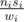

# F. Snow sellers

**time limit per test:** 10 seconds

**memory limit per test:** 256 megabytes

**input:** stdin

**output:** stdout

The New Year celebrations in Berland last *n* days. Only this year the winter is snowless, that’s why the winter celebrations’ organizers should buy artificial snow. There are *m* snow selling companies in Berland. Every day the *i*-th company produces *w*~*i*~ cubic meters of snow. Next day the snow thaws and the company has to produce *w*~*i*~ cubic meters of snow again. During the celebration new year discounts are on, that’s why the snow cost decreases every day. It is known that on the first day the total cost of all the snow produced by the *i*-th company is equal to *c*~*i*~ bourles. Every day this total cost decreases by *a*~*i*~ bourles, i.e. on the second day it is equal to *c*~*i*~ - *a*~*i*~,and on the third day — to *c*~*i*~ - 2*a*~*i*~, and so on. It is known that for one company the cost of the snow produced by it does not get negative or equal to zero. You have to organize the snow purchase so as to buy every day exactly *W* snow cubic meters. At that it is not necessary to buy from any company all the snow produced by it. If you buy *n*~*i*~ cubic meters of snow (0 ≤ *n*~*i*~ ≤ *w*~*i*~, the number *n*~*i*~ is not necessarily integer!) from the *i*-th company at one of the days when the cost of its snow is equal to *s*~*i*~, then its price will total to



 bourles. During one day one can buy the snow from several companies. In different days one can buy the snow from different companies. It is required to make the purchases so as to spend as little money as possible. It is guaranteed that the snow produced by the companies will be enough.

#### Input

The first line contains integers *n*, *m* and *W* (1 ≤ *n* ≤ 100, 1 ≤ *m* ≤ 500000, 1 ≤ *W* ≤ 10^9^) which represent the number of days, the number of companies and the amount of snow that needs to be purchased on every one of the *n* days. The second line contains *m* integers *w*~*i*~. The third line contains *m* integers *c*~*i*~. The fourth line contains *m* integers *a*~*i*~. All the numbers are strictly positive and do not exceed 10^9^. For all the *i* the inequation *c*~*i*~ - (*n* - 1)*a*~*i*~ > 0 holds true.

#### Output

Print a single number — the answer to the given problem. Print the answer in the format with the decimal point (even if the answer is integer, it must contain the decimal point), without "e" and without leading zeroes. The answer should differ with the right one by no more than 10^ - 9^.

#### Examples

#### Input
```
2 3 10
4 4 4
5 5 8
1 2 5
```

#### Output
```
22.000000000000000
```

#### Input
```
100 2 1000000000
999999998 999999999
1000000000 1000000000
1 1
```

#### Output
```
99999995149.999995249999991
```
