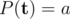
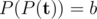
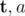
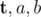

# E. Vasya and Polynomial

**time limit per test:** 2 seconds

**memory limit per test:** 256 megabytes

**input:** stdin

**output:** stdout

Vasya is studying in the last class of school and soon he will take exams. He decided to study polynomials. Polynomial is a function *P*(*x*) = *a*~0~ + *a*~1~*x*^1^ + ... + *a*~*n*~*x*^*n*^. Numbers *a*~*i*~ are called coefficients of a polynomial, non-negative integer *n* is called a degree of a polynomial.

Vasya has made a bet with his friends that he can solve any problem with polynomials. They suggested him the problem: "Determine how many polynomials *P*(*x*) exist with integer non-negative coefficients so that



, and



, where



 and *b* are given positive integers"?

Vasya does not like losing bets, but he has no idea how to solve this task, so please help him to solve the problem.

#### Input

The input contains three integer positive numbers



 no greater than 10^18^.

#### Output

If there is an infinite number of such polynomials, then print "inf" without quotes, otherwise print the reminder of an answer modulo 10^9^ + 7.

#### Examples

#### Input
```
2 2 2
```

#### Output
```
2
```

#### Input
```
2 3 3
```

#### Output
```
1
```
