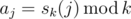

# E. Subsequences Return

**time limit per test:** 1 second

**memory limit per test:** 256 megabytes

**input:** stdin

**output:** stdout

Assume that *s*~*k*~(*n*) equals the sum of digits of number *n* in the *k*-based notation. For example, *s*~2~(5) = *s*~2~(101~2~) = 1 + 0 + 1 = 2, *s*~3~(14) = *s*~3~(112~3~) = 1 + 1 + 2 = 4.

The sequence of integers *a*~0~, ..., *a*~*n* - 1~ is defined as



. Your task is to calculate the number of distinct subsequences of sequence *a*~0~, ..., *a*~*n* - 1~. Calculate the answer modulo 10^9^ + 7.

Sequence *a*~1~, ..., *a*~*k*~ is called to be a subsequence of sequence *b*~1~, ..., *b*~*l*~, if there is a sequence of indices 1 ≤ *i*~1~ < ... < *i*~*k*~ ≤ *l*, such that *a*~1~ = *b*~*i*~1~~, ..., *a*~*k*~ = *b*~*i*~*k*~~. In particular, an empty sequence (i.e. the sequence consisting of zero elements) is a subsequence of any sequence.

#### Input

The first line contains two space-separated numbers *n* and *k* (1 ≤ *n* ≤ 10^18^, 2 ≤ *k* ≤ 30).

#### Output

In a single line print the answer to the problem modulo 10^9^ + 7.

#### Examples

#### Input
```
4 2
```

#### Output
```
11
```

#### Input
```
7 7
```

#### Output
```
128
```

#### Note

In the first sample the sequence *a*~*i*~ looks as follows: (0, 1, 1, 0). All the possible subsequences are:
(), (0), (0, 0), (0, 1), (0, 1, 0), (0, 1, 1), (0, 1, 1, 0), (1), (1, 0), (1, 1), (1, 1, 0).
In the second sample the sequence *a*~*i*~ looks as follows: (0, 1, 2, 3, 4, 5, 6). The subsequences of this sequence are exactly all increasing sequences formed from numbers from 0 to 6. It is easy to see that there are 2^7^ = 128 such sequences.
