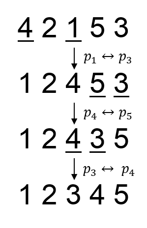

# B. New Year Permutation

**time limit per test:** 2 seconds

**memory limit per test:** 256 megabytes

**input:** stdin

**output:** stdout

User ainta has a permutation *p*~1~, *p*~2~, ..., *p*~*n*~. As the New Year is coming, he wants to make his permutation as pretty as possible.

Permutation *a*~1~, *a*~2~, ..., *a*~*n*~ is prettier than permutation *b*~1~, *b*~2~, ..., *b*~*n*~, if and only if there exists an integer *k* (1 ≤ *k* ≤ *n*) where *a*~1~ = *b*~1~, *a*~2~ = *b*~2~, ..., *a*~*k* - 1~ = *b*~*k* - 1~ and *a*~*k*~ < *b*~*k*~ all holds.

As known, permutation *p* is so sensitive that it could be only modified by swapping two distinct elements. But swapping two elements is harder than you think. Given an *n* × *n* binary matrix *A*, user ainta can swap the values of *p*~*i*~ and *p*~*j*~ (1 ≤ *i*, *j* ≤ *n*, *i* ≠ *j*) if and only if *A*~*i*, *j*~ = 1.

Given the permutation *p* and the matrix *A*, user ainta wants to know the prettiest permutation that he can obtain.

#### Input

The first line contains an integer *n* (1 ≤ *n* ≤ 300) — the size of the permutation *p*.

The second line contains *n* space-separated integers *p*~1~, *p*~2~, ..., *p*~*n*~ — the permutation *p* that user ainta has. Each integer between 1 and *n* occurs exactly once in the given permutation.

Next *n* lines describe the matrix *A*. The *i*-th line contains *n* characters '0' or '1' and describes the *i*-th row of *A*. The *j*-th character of the *i*-th line *A*~*i*, *j*~ is the element on the intersection of the *i*-th row and the *j*-th column of A. It is guaranteed that, for all integers *i*, *j* where 1 ≤ *i* < *j* ≤ *n*, *A*~*i*, *j*~ = *A*~*j*, *i*~ holds. Also, for all integers *i* where 1 ≤ *i* ≤ *n*, *A*~*i*, *i*~ = 0 holds.

#### Output

In the first and only line, print *n* space-separated integers, describing the prettiest permutation that can be obtained.

#### Examples

#### Input
```
7
5 2 4 3 6 7 1
0001001
0000000
0000010
1000001
0000000
0010000
1001000
```

#### Output
```
1 2 4 3 6 7 5
```

#### Input
```
5
4 2 1 5 3
00100
00011
10010
01101
01010
```

#### Output
```
1 2 3 4 5
```

#### Note

In the first sample, the swap needed to obtain the prettiest permutation is: (*p*~1~, *p*~7~).

In the second sample, the swaps needed to obtain the prettiest permutation is (*p*~1~, *p*~3~), (*p*~4~, *p*~5~), (*p*~3~, *p*~4~).





A permutation *p* is a sequence of integers *p*~1~, *p*~2~, ..., *p*~*n*~, consisting of *n* distinct positive integers, each of them doesn't exceed *n*. The *i*-th element of the permutation *p* is denoted as *p*~*i*~. The size of the permutation *p* is denoted as *n*.
