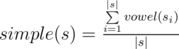
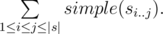

# E. Pretty Song

**time limit per test:** 1 second

**memory limit per test:** 256 megabytes

**input:** stdin

**output:** stdout

When Sasha was studying in the seventh grade, he started listening to music a lot. In order to evaluate which songs he likes more, he introduced the notion of the song's prettiness. The title of the song is a word consisting of uppercase Latin letters. The prettiness of the song is the prettiness of its title.

Let's define the simple prettiness of a word as the ratio of the number of vowels in the word to the number of all letters in the word.

Let's define the prettiness of a word as the sum of simple prettiness of all the substrings of the word.

More formally, let's define the function *vowel*(*c*) which is equal to 1, if *c* is a vowel, and to 0 otherwise. Let *s*~*i*~ be the *i*-th character of string *s*, and *s*~*i*..*j*~ be the substring of word *s*, staring at the *i*-th character and ending at the *j*-th character (*s*~*is*~~*i* + 1~... *s*~*j*~, *i* ≤ *j*).

Then the simple prettiness of *s* is defined by the formula:



The prettiness of *s* equals



Find the prettiness of the given song title.

We assume that the vowels are *I*, *E*, *A*, *O*, *U*, *Y*.

#### Input

The input contains a single string *s* (1 ≤ |*s*| ≤ 5·10^5^) — the title of the song.

#### Output

Print the prettiness of the song with the absolute or relative error of at most 10^ - 6^.

#### Examples

#### Input
```
IEAIAIO
```

#### Output
```
28.0000000
```

#### Input
```
BYOB
```

#### Output
```
5.8333333
```

#### Input
```
YISVOWEL
```

#### Output
```
17.0500000
```

#### Note

In the first sample all letters are vowels. The simple prettiness of each substring is 1. The word of length 7 has 28 substrings. So, the prettiness of the song equals to 28.
