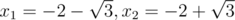
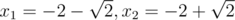
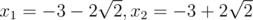
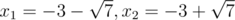
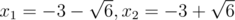

# E. Square Equation Roots

**time limit per test:** 5 seconds

**memory limit per test:** 256 megabytes

**input:** stdin

**output:** stdout

A schoolboy Petya studies square equations. The equations that are included in the school curriculum, usually look simple:
*x*^2^ + 2*bx* + *c* = 0 where *b*, *c* are natural numbers.
Petya noticed that some equations have two real roots, some of them have only one root and some equations don't have real roots at all. Moreover it turned out that several different square equations can have a common root.

Petya is interested in how many different real roots have all the equations of the type described above for all the possible pairs of numbers *b* and *c* such that 1 ≤ *b* ≤ *n*, 1 ≤ *c* ≤ *m*. Help Petya find that number.

#### Input

The single line contains two integers *n* and *m*. (1 ≤ *n*, *m* ≤ 5000000).

#### Output

Print a single number which is the number of real roots of the described set of equations.

#### Examples

#### Input
```
3 3
```

#### Output
```
12
```

#### Input
```
1 2
```

#### Output
```
1
```

#### Note

In the second test from the statement the following equations are analysed:

 *b* = 1, *c* = 1: *x*^2^ + 2*x* + 1 = 0; The root is *x* =  - 1

 *b* = 1, *c* = 2: *x*^2^ + 2*x* + 2 = 0; No roots

 Overall there's one root

In the second test the following equations are analysed:

 *b* = 1, *c* = 1: *x*^2^ + 2*x* + 1 = 0; The root is *x* =  - 1

 *b* = 1, *c* = 2: *x*^2^ + 2*x* + 2 = 0; No roots

 *b* = 1, *c* = 3: *x*^2^ + 2*x* + 3 = 0; No roots

 *b* = 2, *c* = 1: *x*^2^ + 4*x* + 1 = 0; The roots are



 *b* = 2, *c* = 2: *x*^2^ + 4*x* + 2 = 0; The roots are



 *b* = 2, *c* = 3: *x*^2^ + 4*x* + 3 = 0; The roots are *x*~1~ =  - 3, *x*~2~ =  - 1

 *b* = 3, *c* = 1: *x*^2^ + 6*x* + 1 = 0; The roots are



 *b* = 3, *c* = 2: *x*^2^ + 6*x* + 2 = 0; The roots are



 *b* = 3, *c* = 3: *x*^2^ + 6*x* + 3 = 0; The roots are



 Overall there are 13 roots and as the root  - 1 is repeated twice, that means there are 12 different roots.
