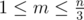

# E. Fox And Dinner

**time limit per test:** 2 seconds

**memory limit per test:** 256 megabytes

**input:** stdin

**output:** stdout

Fox Ciel is participating in a party in Prime Kingdom. There are *n* foxes there (include Fox Ciel). The i-th fox is *a*~*i*~ years old.

They will have dinner around some round tables. You want to distribute foxes such that:

- Each fox is sitting at some table.
- Each table has at least 3 foxes sitting around it.
- The sum of ages of any two adjacent foxes around each table should be a prime number.

If *k* foxes *f*~1~, *f*~2~, ..., *f*~*k*~ are sitting around table in clockwise order, then for 1 ≤ *i* ≤ *k* - 1: *f*~*i*~ and *f*~*i* + 1~ are adjacent, and *f*~1~ and *f*~*k*~ are also adjacent.

If it is possible to distribute the foxes in the desired manner, find out a way to do that.

#### Input

The first line contains single integer *n* (3 ≤ *n* ≤ 200): the number of foxes in this party.

The second line contains *n* integers *a*~*i*~ (2 ≤ *a*~*i*~ ≤ 10^4^).

#### Output

If it is impossible to do this, output "Impossible".

Otherwise, in the first line output an integer *m* (



): the number of tables.

Then output *m* lines, each line should start with an integer *k* -=– the number of foxes around that table, and then *k* numbers — indices of fox sitting around that table in clockwise order.

If there are several possible arrangements, output any of them.

#### Examples

#### Input
```
4
3 4 8 9
```

#### Output
```
1
4 1 2 4 3
```

#### Input
```
5
2 2 2 2 2
```

#### Output
```
Impossible
```

#### Input
```
12
2 3 4 5 6 7 8 9 10 11 12 13
```

#### Output
```
1
12 1 2 3 6 5 12 9 8 7 10 11 4
```

#### Input
```
24
2 3 4 5 6 7 8 9 10 11 12 13 14 15 16 17 18 19 20 21 22 23 24 25
```

#### Output
```
3
6 1 2 3 6 5 4
10 7 8 9 12 15 14 13 16 11 10
8 17 18 23 22 19 20 21 24
```

#### Note

In example 1, they can sit around one table, their ages are: 3-8-9-4, adjacent sums are: 11, 17, 13 and 7, all those integers are primes.

In example 2, it is not possible: the sum of 2+2 = 4 is not a prime number.
