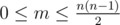
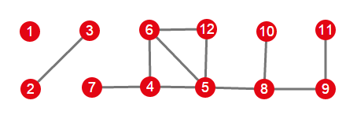

# D. Fox And Travelling

**time limit per test:** 3 seconds

**memory limit per test:** 256 megabytes

**input:** stdin

**output:** stdout

Fox Ciel is going to travel to New Foxland during this summer.

New Foxland has *n* attractions that are linked by *m* undirected roads. Two attractions are called adjacent if they are linked by a road. Fox Ciel has *k* days to visit this city and each day she will visit exactly one attraction.

There is one important rule in New Foxland: you can't visit an attraction if it has more than one adjacent attraction that you haven't visited yet.

At the beginning Fox Ciel haven't visited any attraction. During her travelling she may move aribtrarly between attraction. After visiting attraction *a*, she may travel to any attraction *b* satisfying conditions above that hasn't been visited yet, even if it is not reachable from *a* by using the roads (Ciel uses boat for travelling between attractions, so it is possible).

 She wants to know how many different travelling plans she can make. Calculate this number modulo 10^9^ + 9 for every *k* from 0 to *n* since she hasn't decided for how many days she is visiting New Foxland.

#### Input

First line contains two integers: *n*, *m* (1 ≤ *n* ≤ 100,



), the number of attractions and number of undirected roads.

Then next *m* lines each contain two integers *a*~*i*~ and *b*~*i*~ (1 ≤ *a*~*i*~, *b*~*i*~ ≤ *n* and *a*~*i*~ ≠ *b*~*i*~), describing a road. There is no more than one road connecting each pair of attractions.

#### Output

Output *n* + 1 integer: the number of possible travelling plans modulo 10^9^ + 9 for all *k* from 0 to *n*.

#### Examples

#### Input
```
3 2
1 2
2 3
```

#### Output
```
1
2
4
4
```

#### Input
```
4 4
1 2
2 3
3 4
4 1
```

#### Output
```
1
0
0
0
0
```

#### Input
```
12 11
2 3
4 7
4 5
5 6
4 6
6 12
5 12
5 8
8 9
10 8
11 9
```

#### Output
```
1
6
31
135
483
1380
3060
5040
5040
0
0
0
0
```

#### Input
```
13 0
```

#### Output
```
1
13
156
1716
17160
154440
1235520
8648640
51891840
259459200
37836791
113510373
227020746
227020746
```

#### Note

In the first sample test for *k* = 3 there are 4 travelling plans: {1, 2, 3}, {1, 3, 2}, {3, 1, 2}, {3, 2, 1}.

In the second sample test Ciel can't visit any attraction in the first day, so for *k* > 0 the answer is 0.

In the third sample test Foxlands look like this:


