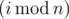
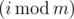
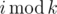

# B. Drazil and His Happy Friends

**time limit per test:** 2 seconds

**memory limit per test:** 256 megabytes

**input:** stdin

**output:** stdout

Drazil has many friends. Some of them are happy and some of them are unhappy. Drazil wants to make all his friends become happy. So he invented the following plan.

There are *n* boys and *m* girls among his friends. Let's number them from 0 to *n* - 1 and 0 to *m* - 1 separately. In *i*-th day, Drazil invites



-th boy and



-th girl to have dinner together (as Drazil is programmer, *i* starts from 0). If one of those two people is happy, the other one will also become happy. Otherwise, those two people remain in their states. Once a person becomes happy (or if he/she was happy originally), he stays happy forever.

Drazil wants to know whether he can use this plan to make all his friends become happy at some moment.

#### Input

The first line contains two integer *n* and *m* (1 ≤ *n*, *m* ≤ 100).

The second line contains integer *b* (0 ≤ *b* ≤ *n*), denoting the number of happy boys among friends of Drazil, and then follow *b* distinct integers *x*~1~, *x*~2~, ..., *x*~*b*~ (0 ≤ *x*~*i*~ < *n*), denoting the list of indices of happy boys.

The third line conatins integer *g* (0 ≤ *g* ≤ *m*), denoting the number of happy girls among friends of Drazil, and then follow *g* distinct integers *y*~1~, *y*~2~, ... , *y*~*g*~ (0 ≤ *y*~*j*~ < *m*), denoting the list of indices of happy girls.

It is guaranteed that there is at least one person that is unhappy among his friends.

#### Output

If Drazil can make all his friends become happy by this plan, print "Yes". Otherwise, print "No".

#### Examples

#### Input
```
2 3
0
1 0
```

#### Output
```
Yes
```

#### Input
```
2 4
1 0
1 2
```

#### Output
```
No
```

#### Input
```
2 3
1 0
1 1
```

#### Output
```
Yes
```

#### Note

By



 we define the remainder of integer division of *i* by *k*.

In first sample case:

- On the 0-th day, Drazil invites 0-th boy and 0-th girl. Because 0-th girl is happy at the beginning, 0-th boy become happy at this day.
- On the 1-st day, Drazil invites 1-st boy and 1-st girl. They are both unhappy, so nothing changes at this day.
- On the 2-nd day, Drazil invites 0-th boy and 2-nd girl. Because 0-th boy is already happy he makes 2-nd girl become happy at this day.
- On the 3-rd day, Drazil invites 1-st boy and 0-th girl. 0-th girl is happy, so she makes 1-st boy happy.
- On the 4-th day, Drazil invites 0-th boy and 1-st girl. 0-th boy is happy, so he makes the 1-st girl happy. So, all friends become happy at this moment.
