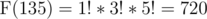
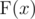
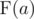
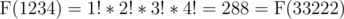

# C. Drazil and Factorial

**time limit per test:** 2 seconds

**memory limit per test:** 256 megabytes

**input:** stdin

**output:** stdout

Drazil is playing a math game with Varda.

Let's define


 for positive integer *x* as a product of factorials of its digits. For example,



.

First, they choose a decimal number *a* consisting of *n* digits that contains at least one digit larger than 1. This number may possibly start with leading zeroes. Then they should find maximum positive number *x* satisfying following two conditions:

1. *x* doesn't contain neither digit 0 nor digit 1.

2.



 =



.

Help friends find such number.

#### Input

The first line contains an integer *n* (1 ≤ *n* ≤ 15) — the number of digits in *a*.

The second line contains *n* digits of *a*. There is at least one digit in *a* that is larger than 1. Number *a* may possibly contain leading zeroes.

#### Output

Output a maximum possible integer satisfying the conditions above. There should be no zeroes and ones in this number decimal representation.

#### Examples

#### Input
```
4
1234
```

#### Output
```
33222
```

#### Input
```
3
555
```

#### Output
```
555
```

#### Note

In the first case,


