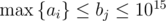

# E. Transmitting Levels

**time limit per test:** 3 seconds

**memory limit per test:** 256 megabytes

**input:** standard input

**output:** standard output

Optimizing the amount of data transmitted via a network is an important and interesting part of developing any network application.


In one secret game developed deep in the ZeptoLab company, the game universe consists of *n* levels, located in a circle. You can get from level *i* to levels *i* - 1 and *i* + 1, also you can get from level 1 to level *n* and vice versa. The map of the *i*-th level description size is *a*~*i*~ bytes.

In order to reduce the transmitted traffic, the game gets levels as follows. All the levels on the server are divided into *m* groups and each time a player finds himself on one of the levels of a certain group for the first time, the server sends all levels of the group to the game client as a single packet. Thus, when a player travels inside the levels of a single group, the application doesn't need any new information. Due to the technical limitations the packet can contain an arbitrary number of levels but their total size mustn't exceed *b* bytes, where *b* is some positive integer constant.

Usual situation is that players finish levels one by one, that's why a decision was made to split *n* levels into *m* groups so that each group was a continuous segment containing multiple neighboring levels (also, the group can have two adjacent levels, *n* and 1). Specifically, if the descriptions of all levels have the total weight of at most *b* bytes, then they can all be united into one group to be sent in a single packet.

Determine, what minimum number of groups do you need to make in order to organize the levels of the game observing the conditions above?

As developing a game is a long process and technology never stagnates, it is yet impossible to predict exactly what value will take constant value *b* limiting the packet size when the game is out. That's why the developers ask you to find the answer for multiple values of *b*.

#### Input

The first line contains two integers *n*, *q* (2 ≤ *n* ≤ 10^6^, 1 ≤ *q* ≤ 50) — the number of levels in the game universe and the number of distinct values of *b* that you need to process.

The second line contains *n* integers *a*~*i*~ (1 ≤ *a*~*i*~ ≤ 10^9^) — the sizes of the levels in bytes.

The next *q* lines contain integers *b*~*j*~ (



), determining the values of constant *b*, for which you need to determine the answer.

#### Output

For each value of *k*~*j*~ from the input print on a single line integer *m*~*j*~ (1 ≤ *m*~*j*~ ≤ *n*), determining the minimum number of groups to divide game levels into for transmission via network observing the given conditions.

#### Examples

#### Input
```
6 3
2 4 2 1 3 2
7
4
6
```

#### Output
```
2
4
3
```

#### Note

In the test from the statement you can do in the following manner.

- at *b* = 7 you can divide into two segments: 2|421|32 (note that one of the segments contains the fifth, sixth and first levels);
- at *b* = 4 you can divide into four segments: 2|4|21|3|2;
- at *b* = 6 you can divide into three segments: 24|21|32|.
