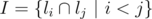
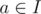
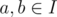
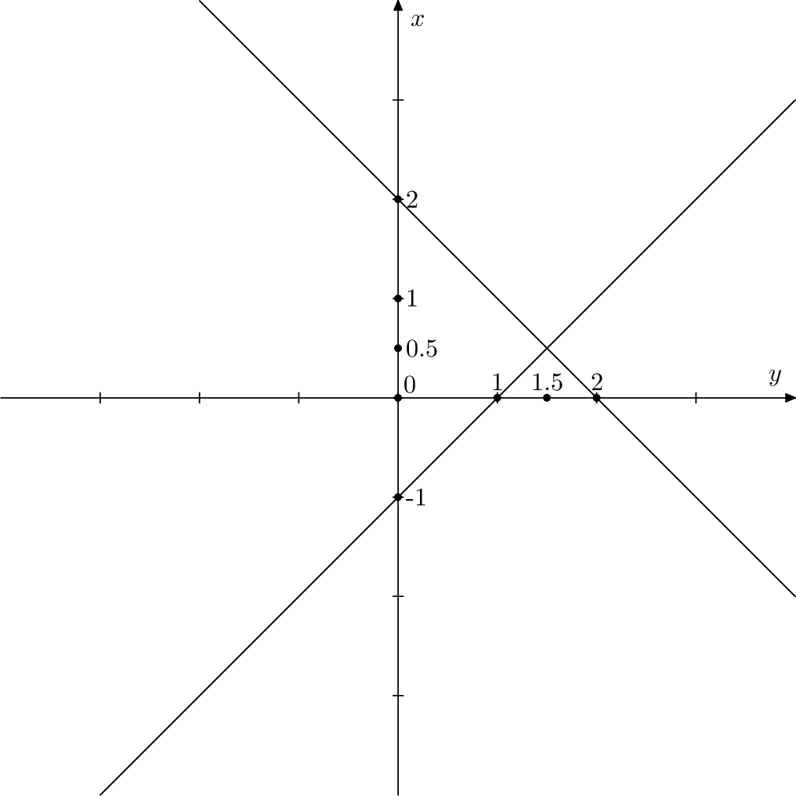

# E. Triangles 3000

**time limit per test:** 5 seconds

**memory limit per test:** 512 megabytes

**input:** standard input

**output:** standard output

You are given a set *L* = {*l*~1~, *l*~2~, ..., *l*~*n*~} of *n* pairwise non-parallel lines on the Euclidean plane. The *i*-th line is given by an equation in the form of *a*~*i*~*x* + *b*~*i*~*y* = *c*~*i*~. *L* doesn't contain three lines coming through the same point.

A subset of three distinct lines is chosen equiprobably. Determine the expected value of the area of the triangle formed by the three lines.

#### Input

The first line of the input contains integer *n* (3 ≤ *n* ≤ 3000).

Each of the next lines contains three integers *a*~*i*~, *b*~*i*~, *c*~*i*~ ( - 100 ≤ *a*~*i*~, *b*~*i*~ ≤ 100, *a*~*i*~^2^ + *b*~*i*~^2^ > 0,  - 10 000 ≤ *c*~*i*~ ≤ 10 000) — the coefficients defining the *i*-th line.

It is guaranteed that no two lines are parallel. Besides, any two lines intersect at angle at least 10^ - 4^ radians.

If we assume that *I* is a set of points of pairwise intersection of the lines (i. e.



), then for any point



 it is true that the coordinates of *a* do not exceed 10^6^ by their absolute values. Also, for any two distinct points



 the distance between *a* and *b* is no less than 10^ - 5^.

#### Output

Print a single real number equal to the sought expected value. Your answer will be checked with the absolute or relative error 10^ - 4^.

#### Examples

#### Input
```
4
1 0 0
0 1 0
1 1 2
-1 1 -1
```

#### Output
```
1.25
```

#### Note

A sample from the statement is shown below. There are four triangles on the plane, their areas are 0.25, 0.5, 2, 2.25.



