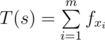

# E. Tavas on the Path

**time limit per test:** 3 seconds

**memory limit per test:** 256 megabytes

**input:** standard input

**output:** standard output

Tavas lives in Tavaspolis. Tavaspolis has *n* cities numbered from 1 to *n* connected by *n* - 1 bidirectional roads. There exists a path between any two cities. Also each road has a length.


Tavas' favorite strings are binary strings (they contain only 0 and 1). For any binary string like *s* = *s*~1~*s*~2~... *s*~*k*~, *T*(*s*) is its *Goodness*. *T*(*s*) can be calculated as follows:

Consider there are exactly *m* blocks of 1s in this string (a block of 1s in *s* is a maximal consecutive substring of *s* that only contains 1) with lengths *x*~1~, *x*~2~, ..., *x*~*m*~.

Define



 where *f* is a given sequence (if *m* = 0, then *T*(*s*) = 0).

Tavas loves queries. He asks you to answer *q* queries. In each query he gives you numbers *v*, *u*, *l* and you should print following number:

Consider the roads on the path from city *v* to city *u*: *e*~1~, *e*~2~, ..., *e*~*x*~.

Build the binary string *b* of length *x* such that: *b*~*i*~ = 1 if and only if *l* ≤ *w*(*e*~*i*~) where *w*(*e*) is the length of road *e*.

You should print *T*(*b*) for this query.

#### Input

The first line of input contains integers *n* and *q* (2 ≤ *n* ≤ 10^5^ and 1 ≤ *q* ≤ 10^5^).

The next line contains *n* - 1 space separated integers *f*~1~, *f*~2~, ..., *f*~*n* - 1~ (|*f*~*i*~| ≤ 1000).

The next *n* - 1 lines contain the details of the roads. Each line contains integers *v*, *u* and *w* and it means that there's a road between cities *v* and *u* of length *w* (1 ≤ *v*, *u* ≤ *n* and 1 ≤ *w* ≤ 10^9^).

The next *q* lines contain the details of the queries. Each line contains integers *v*, *u*, *l* (1 ≤ *v*, *u* ≤ *n*, *v* ≠ *u* and 1 ≤ *l* ≤ 10^9^).

#### Output

Print the answer of each query in a single line.

#### Examples

#### Input
```
2 3
10
1 2 3
1 2 2
1 2 3
1 2 4
```

#### Output
```
10
10
0
```

#### Input
```
6 6
-5 0 0 2 10
1 2 1
2 3 2
3 4 5
4 5 1
5 6 5
1 6 1
1 6 2
1 6 5
3 6 5
4 6 4
1 4 2
```

#### Output
```
10
-5
-10
-10
-5
0
```
