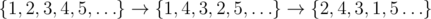

# E. Infinite Inversions

**time limit per test:** 2 seconds

**memory limit per test:** 256 megabytes

**input:** standard input

**output:** standard output

There is an infinite sequence consisting of all positive integers in the increasing order: *p* = {1, 2, 3, ...}. We performed *n* swap operations with this sequence. A *swap*(*a*, *b*) is an operation of swapping the elements of the sequence on positions *a* and *b*. Your task is to find the number of inversions in the resulting sequence, i.e. the number of such index pairs (*i*, *j*), that *i* < *j* and *p*~*i*~ > *p*~*j*~.

#### Input

The first line contains a single integer *n* (1 ≤ *n* ≤ 10^5^) — the number of swap operations applied to the sequence.

Each of the next *n* lines contains two integers *a*~*i*~ and *b*~*i*~ (1 ≤ *a*~*i*~, *b*~*i*~ ≤ 10^9^, *a*~*i*~ ≠ *b*~*i*~) — the arguments of the swap operation.

#### Output

Print a single integer — the number of inversions in the resulting sequence.

#### Examples

#### Input
```
2
4 2
1 4
```

#### Output
```
4
```

#### Input
```
3
1 6
3 4
2 5
```

#### Output
```
15
```

#### Note

In the first sample the sequence is being modified as follows:



. It has 4 inversions formed by index pairs (1, 4), (2, 3), (2, 4) and (3, 4).
