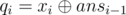

# E. Listening to Music

**time limit per test:** 7 seconds

**memory limit per test:** 64 megabytes

**input:** standard input

**output:** standard output

Please note that the memory limit differs from the standard.

You really love to listen to music. During the each of next *s* days you will listen to exactly *m* songs from the playlist that consists of exactly *n* songs. Let's number the songs from the playlist with numbers from 1 to *n*, inclusive. The quality of song number *i* is *a*~*i*~.

On the *i*-th day you choose some integer *v* (*l*~*i*~ ≤ *v* ≤ *r*~*i*~) and listen to songs number *v*, *v* + 1, ..., *v* + *m* - 1. On the *i*-th day listening to one song with quality less than *q*~*i*~ increases your displeasure by exactly one.

Determine what minimum displeasure you can get on each of the *s* next days.

#### Input

The first line contains two positive integers *n*, *m* (1 ≤ *m* ≤ *n* ≤ 2·10^5^). The second line contains *n* positive integers *a*~1~, *a*~2~, ..., *a*~*n*~ (0 ≤ *a*~*i*~ < 2^30^) — the description of songs from the playlist.

The next line contains a single number *s* (1 ≤ *s* ≤ 2·10^5^) — the number of days that you consider.

The next *s* lines contain three integers each *l*~*i*~, *r*~*i*~, *x*~*i*~ (1 ≤ *l*~*i*~ ≤ *r*~*i*~ ≤ *n* - *m* + 1; 0 ≤ *x*~*i*~ < 2^30^) — the description of the parameters for the *i*-th day. In order to calculate value *q*~*i*~, you need to use formula:



, where *ans*~*i*~ is the answer to the problem for day *i*. Assume that *ans*~0~ = 0.

#### Output

Print exactly *s* integers *ans*~1~, *ans*~2~, ..., *ans*~*s*~, where *ans*~*i*~ is the minimum displeasure that you can get on day *i*.

#### Examples

#### Input
```
5 3
1 2 1 2 3
5
1 1 2
1 3 2
1 3 3
1 3 5
1 3 1
```

#### Output
```
2
0
2
3
1
```
