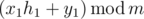
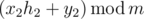
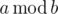

# A. Mike and Frog

**time limit per test:** 1 second

**memory limit per test:** 256 megabytes

**input:** standard input

**output:** standard output

Mike has a frog and a flower. His frog is named Xaniar and his flower is named Abol. Initially(at time 0), height of Xaniar is *h*~1~ and height of Abol is *h*~2~. Each second, Mike waters Abol and Xaniar.


So, if height of Xaniar is *h*~1~ and height of Abol is *h*~2~, after one second height of Xaniar will become



 and height of Abol will become



 where *x*~1~, *y*~1~, *x*~2~ and *y*~2~ are some integer numbers and



 denotes the remainder of *a* modulo *b*.

Mike is a competitive programmer fan. He wants to know the minimum time it takes until height of Xania is *a*~1~ and height of Abol is *a*~2~.

Mike has asked you for your help. Calculate the minimum time or say it will never happen.

#### Input

The first line of input contains integer *m* (2 ≤ *m* ≤ 10^6^).

The second line of input contains integers *h*~1~ and *a*~1~ (0 ≤ *h*~1~, *a*~1~ < *m*).

The third line of input contains integers *x*~1~ and *y*~1~ (0 ≤ *x*~1~, *y*~1~ < *m*).

The fourth line of input contains integers *h*~2~ and *a*~2~ (0 ≤ *h*~2~, *a*~2~ < *m*).

The fifth line of input contains integers *x*~2~ and *y*~2~ (0 ≤ *x*~2~, *y*~2~ < *m*).

It is guaranteed that *h*~1~ ≠ *a*~1~ and *h*~2~ ≠ *a*~2~.

#### Output

Print the minimum number of seconds until Xaniar reaches height *a*~1~ and Abol reaches height *a*~2~ or print -1 otherwise.

#### Examples

#### Input
```
5
4 2
1 1
0 1
2 3
```

#### Output
```
3
```

#### Input
```
1023
1 2
1 0
1 2
1 1
```

#### Output
```
-1
```

#### Note

In the first sample, heights sequences are following:

Xaniar:


Abol:


