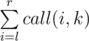
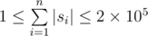

# E. Mike and Friends

**time limit per test:** 3 seconds

**memory limit per test:** 256 megabytes

**input:** standard input

**output:** standard output

What-The-Fatherland is a strange country! All phone numbers there are strings consisting of lowercase English letters. What is double strange that a phone number can be associated with several bears!

In that country there is a rock band called CF consisting of *n* bears (including Mike) numbered from 1 to *n*.


Phone number of *i*-th member of CF is *s*~*i*~. May 17th is a holiday named Phone Calls day. In the last Phone Calls day, everyone called all the numbers that are substrings of his/her number (one may call some number several times). In particular, everyone called himself (that was really strange country).

Denote as *call*(*i*, *j*) the number of times that *i*-th member of CF called the *j*-th member of CF.

The geek Mike has *q* questions that he wants to ask you. In each question he gives you numbers *l*, *r* and *k* and you should tell him the number



#### Input

The first line of input contains integers *n* and *q* (1 ≤ *n* ≤ 2 × 10^5^ and 1 ≤ *q* ≤ 5 × 10^5^).

The next *n* lines contain the phone numbers, *i*-th line contains a string *s*~*i*~ consisting of lowercase English letters (



).

The next *q* lines contain the information about the questions, each of them contains integers *l*, *r* and *k* (1 ≤ *l* ≤ *r* ≤ *n* and 1 ≤ *k* ≤ *n*).

#### Output

Print the answer for each question in a separate line.

#### Examples

#### Input
```
5 5
a
ab
abab
ababab
b
1 5 1
3 5 1
1 5 2
1 5 3
1 4 5
```

#### Output
```
7
5
6
3
6
```
