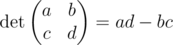
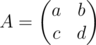
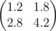
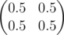

# H. Degenerate Matrix

**time limit per test:** 1 second

**memory limit per test:** 256 megabytes

**input:** standard input

**output:** standard output

The determinant of a matrix 2 × 2 is defined as follows:



A matrix is called degenerate if its determinant is equal to zero.

The norm ||*A*|| of a matrix *A* is defined as a maximum of absolute values of its elements.

You are given a matrix



. Consider any degenerate matrix *B* such that norm ||*A* - *B*|| is minimum possible. Determine ||*A* - *B*||.

#### Input

The first line contains two integers *a* and *b* (|*a*|, |*b*| ≤ 10^9^), the elements of the first row of matrix *A*.

The second line contains two integers *c* and *d* (|*c*|, |*d*| ≤ 10^9^) the elements of the second row of matrix *A*.

#### Output

Output a single real number, the minimum possible value of ||*A* - *B*||. Your answer is considered to be correct if its absolute or relative error does not exceed 10^ - 9^.

#### Examples

#### Input
```
1 2
3 4
```

#### Output
```
0.2000000000
```

#### Input
```
1 0
0 1
```

#### Output
```
0.5000000000
```

#### Note

In the first sample matrix *B* is



In the second sample matrix *B* is


