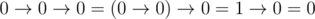
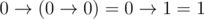
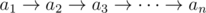
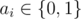

# E. Brackets in Implications

**time limit per test:** 2 seconds

**memory limit per test:** 256 megabytes

**input:** standard input

**output:** standard output

Implication is a function of two logical arguments, its value is false if and only if the value of the first argument is true and the value of the second argument is false.

Implication is written by using character '


', and the arguments and the result of the implication are written as '0' (*false*) and '1' (*true*). According to the definition of the implication:


When a logical expression contains multiple implications, then when there are no brackets, it will be calculated from left to fight. For example,



.

When there are brackets, we first calculate the expression in brackets. For example,



.

For the given logical expression



 determine if it is possible to place there brackets so that the value of a logical expression is false. If it is possible, your task is to find such an arrangement of brackets.

#### Input

The first line contains integer *n* (1 ≤ *n* ≤ 100 000) — the number of arguments in a logical expression.

The second line contains *n* numbers *a*~1~, *a*~2~, ..., *a*~*n*~ (



), which means the values of arguments in the expression in the order they occur.

#### Output

Print "NO" (without the quotes), if it is impossible to place brackets in the expression so that its value was equal to 0.

Otherwise, print "YES" in the first line and the logical expression with the required arrangement of brackets in the second line.

The expression should only contain characters '0', '1', '-' (character with ASCII code 45), '>' (character with ASCII code 62), '(' and ')'. Characters '-' and '>' can occur in an expression only paired like that: ("->") and represent implication. The total number of logical arguments (i.e. digits '0' and '1') in the expression must be equal to *n*. The order in which the digits follow in the expression from left to right must coincide with *a*~1~, *a*~2~, ..., *a*~*n*~.

The expression should be correct. More formally, a correct expression is determined as follows:

- Expressions "0", "1" (without the quotes) are correct.
- If *v*~1~, *v*~2~ are correct, then *v*~1~->*v*~2~ is a correct expression.
- If *v* is a correct expression, then (*v*) is a correct expression.

The total number of characters in the resulting expression mustn't exceed 10^6^.

If there are multiple possible answers, you are allowed to print any of them.

#### Examples

#### Input
```
4
0 1 1 0
```

#### Output
```
YES
(((0)->1)->(1->0))
```

#### Input
```
2
1 1
```

#### Output
```
NO
```

#### Input
```
1
0
```

#### Output
```
YES
0
```
