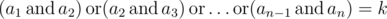
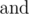
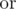

# D. GukiZ and Binary Operations

**time limit per test:** 1 second

**memory limit per test:** 256 megabytes

**input:** standard input

**output:** standard output

We all know that GukiZ often plays with arrays.

Now he is thinking about this problem: how many arrays *a*, of length *n*, with non-negative elements strictly less then 2^*l*^ meet the following condition:



? Here operation



 means bitwise AND (in Pascal it is equivalent to and, in C/C++/Java/Python it is equivalent to &), operation


 means bitwise OR (in Pascal it is equivalent to



, in C/C++/Java/Python it is equivalent to |).

Because the answer can be quite large, calculate it modulo *m*. This time GukiZ hasn't come up with solution, and needs you to help him!

#### Input

First and the only line of input contains four integers *n*, *k*, *l*, *m* (2 ≤ *n* ≤ 10^18^, 0 ≤ *k* ≤ 10^18^, 0 ≤ *l* ≤ 64, 1 ≤ *m* ≤ 10^9^ + 7).

#### Output

In the single line print the number of arrays satisfying the condition above modulo *m*.

#### Examples

#### Input
```
2 1 2 10
```

#### Output
```
3
```

#### Input
```
2 1 1 3
```

#### Output
```
1
```

#### Input
```
3 3 2 10
```

#### Output
```
9
```

#### Note

In the first sample, satisfying arrays are {1, 1}, {3, 1}, {1, 3}.

In the second sample, only satisfying array is {1, 1}.

In the third sample, satisfying arrays are {0, 3, 3}, {1, 3, 2}, {1, 3, 3}, {2, 3, 1}, {2, 3, 3}, {3, 3, 0}, {3, 3, 1}, {3, 3, 2}, {3, 3, 3}.
