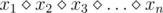

# E. Vanya and Brackets

**time limit per test:** 1 second

**memory limit per test:** 256 megabytes

**input:** standard input

**output:** standard output

Vanya is doing his maths homework. He has an expression of form



, where *x*~1~, *x*~2~, ..., *x*~*n*~ are digits from 1 to 9, and sign


 represents either a plus '+' or the multiplication sign '*'. Vanya needs to add one pair of brackets in this expression so that to maximize the value of the resulting expression.

#### Input

The first line contains expression *s* (1 ≤ |*s*| ≤ 5001, |*s*| is odd), its odd positions only contain digits from 1 to 9, and even positions only contain signs  +  and  * .

The number of signs  *  doesn't exceed 15.

#### Output

In the first line print the maximum possible value of an expression.

#### Examples

#### Input
```
3+5*7+8*4
```

#### Output
```
303
```

#### Input
```
2+3*5
```

#### Output
```
25
```

#### Input
```
3*4*5
```

#### Output
```
60
```

#### Note

Note to the first sample test. 3 + 5 * (7 + 8) * 4 = 303.

Note to the second sample test. (2 + 3) * 5 = 25.

Note to the third sample test. (3 * 4) * 5 = 60 (also many other variants are valid, for instance, (3) * 4 * 5 = 60).
