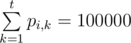

# E. Kyoya and Train

**time limit per test:** 8 seconds

**memory limit per test:** 512 megabytes

**input:** standard input

**output:** standard output

Kyoya Ootori wants to take the train to get to school. There are *n* train stations and *m* one-way train lines going between various stations. Kyoya is currently at train station 1, and the school is at station *n*. To take a train, he must pay for a ticket, and the train also takes a certain amount of time. However, the trains are not perfect and take random amounts of time to arrive at their destination. If Kyoya arrives at school strictly after *t* time units, he will have to pay a fine of *x*.

Each train line is described by a ticket price, and a probability distribution on the time the train takes. More formally, train line *i* has ticket cost *c*~*i*~, and a probability distribution *p*~*i*, *k*~ which denotes the probability that this train will take *k* time units for all 1 ≤ *k* ≤ *t*. Amounts of time that each of the trains used by Kyouya takes are mutually independent random values (moreover, if Kyoya travels along the same train more than once, it is possible for the train to take different amounts of time and those amounts are also independent one from another).

Kyoya wants to get to school by spending the least amount of money in expectation (for the ticket price plus possible fine for being late). Of course, Kyoya has an optimal plan for how to get to school, and every time he arrives at a train station, he may recalculate his plan based on how much time he has remaining. What is the expected cost that Kyoya will pay to get to school if he moves optimally?

#### Input

The first line of input contains four integers *n*, *m*, *t*, *x* (2  ≤  *n*  ≤ 50, 1 ≤ *m* ≤ 100, 1 ≤ *t* ≤ 20 000, 0 ≤ *x* ≤ 10^6^).

The next 2*m* lines contain the description of the trains.

The 2*i*-th line will have 3 integers *a*~*i*~, *b*~*i*~, *c*~*i*~, representing a one way train from station *a*~*i*~ to *b*~*i*~ with ticket cost *c*~*i*~ (1 ≤ *a*~*i*~, *b*~*i*~ ≤ *n*, *a*~*i*~ ≠ *b*~*i*~, 0 ≤ *c*~*i*~ ≤ 10^6^). There will always be at least one path from any station to the school.

The (2*i* + 1)-th line will contain *t* integers, *p*~*i*, 1~, *p*~*i*, 2~, ..., *p*~*i*, *t*~ where *p*~*i*, *k*~ / 100000 is the probability that this train will take *k* units of time to traverse (0 ≤ *p*~*i*, *k*~ ≤ 100 000 for 1 ≤ *k* ≤ *t*,



).

It is guaranteed that there is no more than one train between each pair of platforms in each of the directions.

#### Output

Print a single real number that is equal to an optimal expected cost of getting to school. The answer will be considered correct if its relative or absolute error doesn't exceed 10^ - 6^.

#### Examples

#### Input
```
4 4 5 1
1 2 0
50000 0 50000 0 0
2 3 0
10000 0 0 0 90000
3 4 0
100000 0 0 0 0
2 4 0
0 0 0 50000 50000
```

#### Output
```
0.7000000000
```

#### Input
```
4 4 5 1
1 2 100
50000 0 50000 0 0
2 3 100
10000 0 0 0 90000
3 4 100
100000 0 0 0 0
2 4 100
0 0 0 50000 50000
```

#### Output
```
200.7500000000
```

#### Note

The optimal strategy in the first case is as follows:

First, travel along first train line. With probability 1 / 2 Kyoya will take 1 time unit. Otherwise, Kyoya will take 3 time units.

If the train takes 1 time unit, travel along the 4th train line. Kyoya will make it to school in time with probability 1 / 2. Otherwise, if the train takes 3 time units, travel along the 2nd train line. Kyoya will make it to school in time with probability 1 / 10.

Since the cost of all train lines are zero, we can just look at the probability that Kyoya will incur the penalty. The probability that Kyoya will have to pay the penalty is 1 / 2 × 1 / 2 + 1 / 2 × 9 / 10 = 7 / 10. We can show that no other strategy is strictly better.

The optimal strategy in the second case is to travel along 1 → 2 → 4 no matter what. Kyoya will incur the penalty with probability 3 / 4, and the cost of the trains is 200, thus the expected cost is 200.75.
