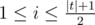

# E. Ann and Half-Palindrome

**time limit per test:** 1.5 seconds

**memory limit per test:** 512 megabytes

**input:** standard input

**output:** standard output

Tomorrow Ann takes the hardest exam of programming where she should get an excellent mark.

On the last theoretical class the teacher introduced the notion of a half-palindrome.

String *t* is a half-palindrome, if for all the odd positions *i* (



) the following condition is held: *t*~*i*~ = *t*~|*t*| - *i* + 1~, where |*t*| is the length of string *t* if positions are indexed from 1. For example, strings "abaa", "a", "bb", "abbbaa" are half-palindromes and strings "ab", "bba" and "aaabaa" are not.

Ann knows that on the exam she will get string *s*, consisting only of letters a and b, and number *k*. To get an excellent mark she has to find the *k*-th in the lexicographical order string among all substrings of *s* that are half-palyndromes. Note that each substring in this order is considered as many times as many times it occurs in *s*.

The teachers guarantees that the given number *k* doesn't exceed the number of substrings of the given string that are half-palindromes.

Can you cope with this problem?

#### Input

The first line of the input contains string *s* (1 ≤ |*s*| ≤ 5000), consisting only of characters 'a' and 'b', where |*s*| is the length of string *s*.

The second line contains a positive integer *k* —  the lexicographical number of the requested string among all the half-palindrome substrings of the given string *s*. The strings are numbered starting from one.

It is guaranteed that number *k* doesn't exceed the number of substrings of the given string that are half-palindromes.

#### Output

Print a substring of the given string that is the *k*-th in the lexicographical order of all substrings of the given string that are half-palindromes.

#### Examples

#### Input
```
abbabaab
7
```

#### Output
```
abaa
```

#### Input
```
aaaaa
10
```

#### Output
```
aaa
```

#### Input
```
bbaabb
13
```

#### Output
```
bbaabb
```

#### Note

By definition, string *a* = *a*~1~*a*~2~... *a*~*n*~ is lexicographically less than string *b* = *b*~1~*b*~2~... *b*~*m*~, if either *a* is a prefix of *b* and doesn't coincide with *b*, or there exists such *i*, that *a*~1~ = *b*~1~, *a*~2~ = *b*~2~, ... *a*~*i* - 1~ = *b*~*i* - 1~, *a*~*i*~ < *b*~*i*~.

In the first sample half-palindrome substrings are the following strings — a, a, a, a, aa, aba, abaa, abba, abbabaa, b, b, b, b, baab, bab, bb, bbab, bbabaab (the list is given in the lexicographical order).
