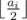

# C. Amr and Chemistry

**time limit per test:** 1 second

**memory limit per test:** 256 megabytes

**input:** standard input

**output:** standard output

Amr loves Chemistry, and specially doing experiments. He is preparing for a new interesting experiment.

Amr has *n* different types of chemicals. Each chemical *i* has an initial volume of *a*~*i*~ liters. For this experiment, Amr has to mix all the chemicals together, but all the chemicals volumes must be equal first. So his task is to make all the chemicals volumes equal.

To do this, Amr can do two different kind of operations.

- Choose some chemical *i* and double its current volume so the new volume will be 2*a*~*i*~
- Choose some chemical *i* and divide its volume by two (integer division) so the new volume will be




Suppose that each chemical is contained in a vessel of infinite volume. Now Amr wonders what is the minimum number of operations required to make all the chemicals volumes equal?

#### Input

The first line contains one number *n* (1 ≤ *n* ≤ 10^5^), the number of chemicals.

The second line contains *n* space separated integers *a*~*i*~ (1 ≤ *a*~*i*~ ≤ 10^5^), representing the initial volume of the *i*-th chemical in liters.

#### Output

Output one integer the minimum number of operations required to make all the chemicals volumes equal.

#### Examples

#### Input
```
3
4 8 2
```

#### Output
```
2
```

#### Input
```
3
3 5 6
```

#### Output
```
5
```

#### Note

In the first sample test, the optimal solution is to divide the second chemical volume by two, and multiply the third chemical volume by two to make all the volumes equal 4.

In the second sample test, the optimal solution is to divide the first chemical volume by two, and divide the second and the third chemical volumes by two twice to make all the volumes equal 1.
