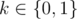

# E. A Simple Task

**time limit per test:** 5 seconds

**memory limit per test:** 512 megabytes

**input:** standard input

**output:** standard output

This task is very simple. Given a string *S* of length *n* and *q* queries each query is on the format *i* *j* *k* which means sort the substring consisting of the characters from *i* to *j* in non-decreasing order if *k* = 1 or in non-increasing order if *k* = 0.

Output the final string after applying the queries.

#### Input

The first line will contain two integers *n*, *q* (1 ≤ *n* ≤ 10^5^, 0 ≤ *q* ≤ 50 000), the length of the string and the number of queries respectively.

Next line contains a string *S* itself. It contains only lowercase English letters.

Next *q* lines will contain three integers each *i*, *j*, *k* (1 ≤ *i* ≤ *j* ≤ *n*,



).

#### Output

Output one line, the string *S* after applying the queries.

#### Examples

#### Input
```
10 5
abacdabcda
7 10 0
5 8 1
1 4 0
3 6 0
7 10 1
```

#### Output
```
cbcaaaabdd
```

#### Input
```
10 1
agjucbvdfk
1 10 1
```

#### Output
```
abcdfgjkuv
```

#### Note

First sample test explanation:


