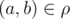
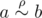
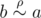
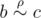
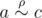
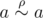
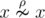

# B. Symmetric and Transitive

**time limit per test:** 1.5 seconds

**memory limit per test:** 256 megabytes

**input:** standard input

**output:** standard output

Little Johnny has recently learned about set theory. Now he is studying binary relations. You've probably heard the term "equivalence relation". These relations are very important in many areas of mathematics. For example, the equality of the two numbers is an equivalence relation.

A set ρ of pairs (*a*, *b*) of elements of some set *A* is called a binary relation on set *A*. For two elements *a* and *b* of the set *A* we say that they are in relation ρ, if pair



, in this case we use a notation


.

Binary relation is equivalence relation, if:
- It is reflexive (for any *a* it is true that


);
- It is symmetric (for any *a*, *b* it is true that if



, then



);
- It is transitive (if


 and



, than



).

Little Johnny is not completely a fool and he noticed that the first condition is not necessary! Here is his "proof":

Take any two elements, *a* and *b*. If


, then


 (according to property (2)), which means



 (according to property (3)).

It's very simple, isn't it? However, you noticed that Johnny's "proof" is wrong, and decided to show him a lot of examples that prove him wrong.

Here's your task: count the number of binary relations over a set of size *n* such that they are symmetric, transitive, but not an equivalence relations (i.e. they are not reflexive).

Since their number may be very large (not 0, according to Little Johnny), print the remainder of integer division of this number by 10^9^ + 7.

#### Input

A single line contains a single integer *n* (1 ≤ *n* ≤ 4000).

#### Output

In a single line print the answer to the problem modulo 10^9^ + 7.

#### Examples

#### Input
```
1
```

#### Output
```
1
```

#### Input
```
2
```

#### Output
```
3
```

#### Input
```
3
```

#### Output
```
10
```

#### Note

If *n* = 1 there is only one such relation — an empty one, i.e.


. In other words, for a single element *x* of set *A* the following is hold:



.

If *n* = 2 there are three such relations. Let's assume that set *A* consists of two elements, *x* and *y*. Then the valid relations are


, ρ = {(*x*, *x*)}, ρ = {(*y*, *y*)}. It is easy to see that the three listed binary relations are symmetric and transitive relations, but they are not equivalence relations.
