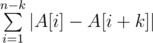

# B. Minimization

**time limit per test:** 2 seconds

**memory limit per test:** 256 megabytes

**input:** standard input

**output:** standard output

You've got array *A*, consisting of *n* integers and a positive integer *k*. Array *A* is indexed by integers from 1 to *n*.

You need to permute the array elements so that value



 became minimal possible. In particular, it is allowed not to change order of elements at all.

#### Input

The first line contains two integers *n*, *k* (2 ≤ *n* ≤ 3·10^5^, 1 ≤ *k* ≤ *min*(5000, *n* - 1)).

The second line contains *n* integers *A*[1], *A*[2], ..., *A*[*n*] ( - 10^9^ ≤ *A*[*i*] ≤ 10^9^), separate by spaces — elements of the array *A*.

#### Output

Print the minimum possible value of the sum described in the statement.

#### Examples

#### Input
```
3 2
1 2 4
```

#### Output
```
1
```

#### Input
```
5 2
3 -5 3 -5 3
```

#### Output
```
0
```

#### Input
```
6 3
4 3 4 3 2 5
```

#### Output
```
3
```

#### Note

In the first test one of the optimal permutations is 1 4 2.

In the second test the initial order is optimal.

In the third test one of the optimal permutations is 2 3 4 4 3 5.
