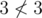

# A. Arrays

**time limit per test:** 2 seconds

**memory limit per test:** 256 megabytes

**input:** standard input

**output:** standard output

You are given two arrays *A* and *B* consisting of integers, sorted in non-decreasing order. Check whether it is possible to choose *k* numbers in array *A* and choose *m* numbers in array *B* so that any number chosen in the first array is strictly less than any number chosen in the second array.

#### Input

The first line contains two integers *n*~*A*~, *n*~*B*~ (1 ≤ *n*~*A*~, *n*~*B*~ ≤ 10^5^), separated by a space — the sizes of arrays *A* and *B*, correspondingly.

The second line contains two integers *k* and *m* (1 ≤ *k* ≤ *n*~*A*~, 1 ≤ *m* ≤ *n*~*B*~), separated by a space.

The third line contains *n*~*A*~ numbers *a*~1~, *a*~2~, ... *a*~*n*~*A*~~ ( - 10^9^ ≤ *a*~1~ ≤ *a*~2~ ≤ ... ≤ *a*~*n*~*A*~~ ≤ 10^9^), separated by spaces — elements of array *A*.

The fourth line contains *n*~*B*~ integers *b*~1~, *b*~2~, ... *b*~*n*~*B*~~ ( - 10^9^ ≤ *b*~1~ ≤ *b*~2~ ≤ ... ≤ *b*~*n*~*B*~~ ≤ 10^9^), separated by spaces — elements of array *B*.

#### Output

Print "YES" (without the quotes), if you can choose *k* numbers in array *A* and *m* numbers in array *B* so that any number chosen in array *A* was strictly less than any number chosen in array *B*. Otherwise, print "NO" (without the quotes).

#### Examples

#### Input
```
3 3
2 1
1 2 3
3 4 5
```

#### Output
```
YES
```

#### Input
```
3 3
3 3
1 2 3
3 4 5
```

#### Output
```
NO
```

#### Input
```
5 2
3 1
1 1 1 1 1
2 2
```

#### Output
```
YES
```

#### Note

In the first sample test you can, for example, choose numbers 1 and 2 from array *A* and number 3 from array *B* (1 < 3 and 2 < 3).

In the second sample test the only way to choose *k* elements in the first array and *m* elements in the second one is to choose all numbers in both arrays, but then not all the numbers chosen in *A* will be less than all the numbers chosen in *B*:



.
