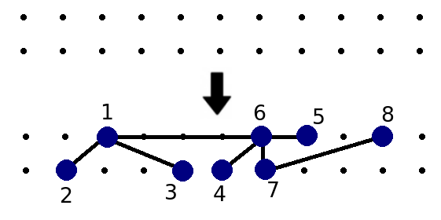

# C. Bear and Drawing

**time limit per test:** 1 second

**memory limit per test:** 256 megabytes

**input:** standard input

**output:** standard output

Limak is a little bear who learns to draw. People usually start with houses, fences and flowers but why would bears do it? Limak lives in the forest and he decides to draw a tree.

Recall that tree is a connected graph consisting of *n* vertices and *n* - 1 edges.

Limak chose a tree with *n* vertices. He has infinite strip of paper with two parallel rows of dots. Little bear wants to assign vertices of a tree to some *n* distinct dots on a paper so that edges would intersect only at their endpoints — drawn tree must be planar. Below you can see one of correct drawings for the first sample test.





Is it possible for Limak to draw chosen tree?

#### Input

The first line contains single integer *n* (1 ≤ *n* ≤ 10^5^).

Next *n* - 1 lines contain description of a tree. *i*-th of them contains two space-separated integers *a*~*i*~ and *b*~*i*~ (1 ≤ *a*~*i*~, *b*~*i*~ ≤ *n*, *a*~*i*~ ≠ *b*~*i*~) denoting an edge between vertices *a*~*i*~ and *b*~*i*~. It's guaranteed that given description forms a tree.

#### Output

Print "Yes" (without the quotes) if Limak can draw chosen tree. Otherwise, print "No" (without the quotes).

#### Examples

#### Input
```
8
1 2
1 3
1 6
6 4
6 7
6 5
7 8
```

#### Output
```
Yes
```

#### Input
```
13
1 2
1 3
1 4
2 5
2 6
2 7
3 8
3 9
3 10
4 11
4 12
4 13
```

#### Output
```
No
```
