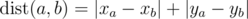
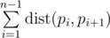
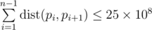
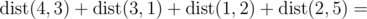

# C. Points on Plane

**time limit per test:** 2 seconds

**memory limit per test:** 256 megabytes

**input:** standard input

**output:** standard output

On a plane are *n* points (*x*~*i*~, *y*~*i*~) with integer coordinates between 0 and 10^6^. The distance between the two points with numbers *a* and *b* is said to be the following value:



 (the distance calculated by such formula is called Manhattan distance).

We call a hamiltonian path to be some permutation *p*~*i*~ of numbers from 1 to *n*. We say that the length of this path is value



.

Find some hamiltonian path with a length of no more than 25 × 10^8^. Note that you do not have to minimize the path length.

#### Input

The first line contains integer *n* (1 ≤ *n* ≤ 10^6^).

The *i* + 1-th line contains the coordinates of the *i*-th point: *x*~*i*~ and *y*~*i*~ (0 ≤ *x*~*i*~, *y*~*i*~ ≤ 10^6^).

It is guaranteed that no two points coincide.

#### Output

Print the permutation of numbers *p*~*i*~ from 1 to *n* — the sought Hamiltonian path. The permutation must meet the inequality



.

If there are multiple possible answers, print any of them.

It is guaranteed that the answer exists.

#### Examples

#### Input
```
5
0 7
8 10
3 4
5 0
9 12
```

#### Output
```
4 3 1 2 5 
```

#### Note

In the sample test the total distance is:



(|5 - 3| + |0 - 4|) + (|3 - 0| + |4 - 7|) + (|0 - 8| + |7 - 10|) + (|8 - 9| + |10 - 12|) = 2 + 4 + 3 + 3 + 8 + 3 + 1 + 2 = 26
