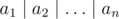
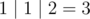

# B. "Or" Game

**time limit per test:** 2 seconds

**memory limit per test:** 256 megabytes

**input:** standard input

**output:** standard output

You are given *n* numbers *a*~1~, *a*~2~, ..., *a*~*n*~. You can perform at most *k* operations. For each operation you can multiply one of the numbers by *x*. We want to make


 as large as possible, where


 denotes the bitwise OR.

Find the maximum possible value of



 after performing at most *k* operations optimally.

#### Input

The first line contains three integers *n*, *k* and *x* (1 ≤ *n* ≤ 200 000, 1 ≤ *k* ≤ 10, 2 ≤ *x* ≤ 8).

The second line contains *n* integers *a*~1~, *a*~2~, ..., *a*~*n*~ (0 ≤ *a*~*i*~ ≤ 10^9^).

#### Output

Output the maximum value of a bitwise OR of sequence elements after performing operations.

#### Examples

#### Input
```
3 1 2
1 1 1
```

#### Output
```
3
```

#### Input
```
4 2 3
1 2 4 8
```

#### Output
```
79
```

#### Note

For the first sample, any possible choice of doing one operation will result the same three numbers 1, 1, 2 so the result is



.

For the second sample if we multiply 8 by 3 two times we'll get 72. In this case the numbers will become 1, 2, 4, 72 so the OR value will be 79 and is the largest possible result.
