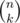
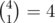
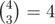
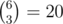

# D. Number of Binominal Coefficients

**time limit per test:** 4 seconds

**memory limit per test:** 256 megabytes

**input:** standard input

**output:** standard output

For a given prime integer *p* and integers α, *A* calculate the number of pairs of integers (*n*, *k*), such that 0 ≤ *k* ≤ *n* ≤ *A* and


 is divisible by *p*^α^.

As the answer can be rather large, print the remainder of the answer moduly 10^9^ + 7.

Let us remind you that



 is the number of ways *k* objects can be chosen from the set of *n* objects.

#### Input

The first line contains two integers, *p* and α (1 ≤ *p*, α ≤ 10^9^, *p* is prime).

The second line contains the decimal record of integer *A* (0 ≤ *A* < 10^1000^) without leading zeroes.

#### Output

In the single line print the answer to the problem.

#### Examples

#### Input
```
2 2
7
```

#### Output
```
3
```

#### Input
```
3 1
9
```

#### Output
```
17
```

#### Input
```
3 3
9
```

#### Output
```
0
```

#### Input
```
2 4
5000
```

#### Output
```
8576851
```

#### Note

In the first sample three binominal coefficients divisible by 4 are



,



 and



.
