# B. Duff in Beach

**time limit per test:** 2 seconds

**memory limit per test:** 256 megabytes

**input:** standard input

**output:** standard output

While Duff was resting in the beach, she accidentally found a strange array *b*~0~, *b*~1~, ..., *b*~*l* - 1~ consisting of *l* positive integers. This array was strange because it was extremely long, but there was another (maybe shorter) array, *a*~0~, ..., *a*~*n* - 1~ that *b* can be build from *a* with formula: *b*~*i*~ = *a*~*i* *mod* *n*~ where *a* *mod* *b* denoted the remainder of dividing *a* by *b*.


Duff is so curious, she wants to know the number of subsequences of *b* like *b*~*i*~1~~, *b*~*i*~2~~, ..., *b*~*i*~*x*~~ (0 ≤ *i*~1~ < *i*~2~ < ... < *i*~*x*~ < *l*), such that:

- 1 ≤ *x* ≤ *k*
- For each 1 ≤ *j* ≤ *x* - 1,

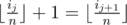


- For each 1 ≤ *j* ≤ *x* - 1, *b*~*i*~*j*~~ ≤ *b*~*i*~*j* + 1~~. i.e this subsequence is non-decreasing.

Since this number can be very large, she want to know it modulo 10^9^ + 7.

Duff is not a programmer, and Malek is unavailable at the moment. So she asked for your help. Please tell her this number.

#### Input

The first line of input contains three integers, *n*, *l* and *k* (1 ≤ *n*, *k*, *n* × *k* ≤ 10^6^ and 1 ≤ *l* ≤ 10^18^).

The second line contains *n* space separated integers, *a*~0~, *a*~1~, ..., *a*~*n* - 1~ (1 ≤ *a*~*i*~ ≤ 10^9^ for each 0 ≤ *i* ≤ *n* - 1).

#### Output

Print the answer modulo 1 000 000 007 in one line.

#### Examples

#### Input
```
3 5 3
5 9 1
```

#### Output
```
10
```

#### Input
```
5 10 3
1 2 3 4 5
```

#### Output
```
25
```

#### Note

In the first sample case,

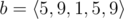

. So all such sequences are:

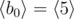

,

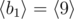

,

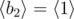

,

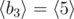

,

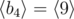

,

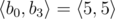

,

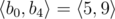

,

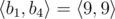

,

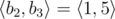

 and

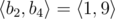

.
