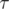
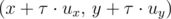
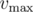
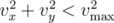
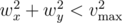

# B. Chip 'n Dale Rescue Rangers

**time limit per test:** 1 second

**memory limit per test:** 256 megabytes

**input:** standard input

**output:** standard output

A team of furry rescue rangers was sitting idle in their hollow tree when suddenly they received a signal of distress. In a few moments they were ready, and the dirigible of the rescue chipmunks hit the road.

We assume that the action takes place on a Cartesian plane. The headquarters of the rescuers is located at point (*x*~1~, *y*~1~), and the distress signal came from the point (*x*~2~, *y*~2~).

Due to Gadget's engineering talent, the rescuers' dirigible can instantly change its current velocity and direction of movement at any moment and as many times as needed. The only limitation is: the speed of the aircraft relative to the air can not exceed


 meters per second.

Of course, Gadget is a true rescuer and wants to reach the destination as soon as possible. The matter is complicated by the fact that the wind is blowing in the air and it affects the movement of the dirigible. According to the weather forecast, the wind will be defined by the vector (*v*~*x*~, *v*~*y*~) for the nearest *t* seconds, and then will change to (*w*~*x*~, *w*~*y*~). These vectors give both the direction and velocity of the wind. Formally, if a dirigible is located at the point (*x*, *y*), while its own velocity relative to the air is equal to zero and the wind (*u*~*x*~, *u*~*y*~) is blowing, then after



 seconds the new position of the dirigible will be



.

Gadget is busy piloting the aircraft, so she asked Chip to calculate how long will it take them to reach the destination if they fly optimally. He coped with the task easily, but Dale is convinced that Chip has given the random value, aiming only not to lose the face in front of Gadget. Dale has asked you to find the right answer.

It is guaranteed that the speed of the wind at any moment of time is strictly less than the maximum possible speed of the airship relative to the air.

#### Input

The first line of the input contains four integers *x*~1~, *y*~1~, *x*~2~, *y*~2~ (|*x*~1~|,  |*y*~1~|,  |*x*~2~|,  |*y*~2~| ≤ 10 000) — the coordinates of the rescuers' headquarters and the point, where signal of the distress came from, respectively.

The second line contains two integers



 and *t* (0 < *v*, *t* ≤ 1000), which are denoting the maximum speed of the chipmunk dirigible relative to the air and the moment of time when the wind changes according to the weather forecast, respectively.

Next follow one per line two pairs of integer (*v*~*x*~, *v*~*y*~) and (*w*~*x*~, *w*~*y*~), describing the wind for the first *t* seconds and the wind that will blow at all the remaining time, respectively. It is guaranteed that



 and



.

#### Output

Print a single real value — the minimum time the rescuers need to get to point (*x*~2~, *y*~2~). You answer will be considered correct if its absolute or relative error does not exceed 10^ - 6^.

Namely: let's assume that your answer is *a*, and the answer of the jury is *b*. The checker program will consider your answer correct, if


.

#### Examples

#### Input
```
0 0 5 5
3 2
-1 -1
-1 0
```

#### Output
```
3.729935587093555327
```

#### Input
```
0 0 0 1000
100 1000
-50 0
50 0
```

#### Output
```
11.547005383792516398
```
