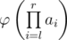

# D. REQ

**time limit per test:** 3 seconds

**memory limit per test:** 256 megabytes

**input:** standard input

**output:** standard output

Today on a math lesson the teacher told Vovochka that the Euler function of a positive integer φ(*n*) is an arithmetic function that counts the positive integers less than or equal to n that are relatively prime to n. The number 1 is coprime to all the positive integers and φ(1) = 1.

Now the teacher gave Vovochka an array of *n* positive integers *a*~1~, *a*~2~, ..., *a*~*n*~ and a task to process *q* queries *l*~*i*~ *r*~*i*~ — to calculate and print



 modulo 10^9^ + 7. As it is too hard for a second grade school student, you've decided to help Vovochka.

#### Input

The first line of the input contains number *n* (1 ≤ *n* ≤ 200 000) — the length of the array given to Vovochka. The second line contains *n* integers *a*~1~, *a*~2~, ..., *a*~*n*~ (1 ≤ *a*~*i*~ ≤ 10^6^).

The third line contains integer *q* (1 ≤ *q* ≤ 200 000) — the number of queries. Next *q* lines contain the queries, one per line. Each query is defined by the boundaries of the segment *l*~*i*~ and *r*~*i*~ (1 ≤ *l*~*i*~ ≤ *r*~*i*~ ≤ *n*).

#### Output

Print *q* numbers — the value of the Euler function for each query, calculated modulo 10^9^ + 7.

#### Examples

#### Input
```
10
1 2 3 4 5 6 7 8 9 10
7
1 1
3 8
5 6
4 8
8 10
7 9
7 10
```

#### Output
```
1
4608
8
1536
192
144
1152
```

#### Input
```
7
24 63 13 52 6 10 1
6
3 5
4 7
1 7
2 4
3 6
2 6
```

#### Output
```
1248
768
12939264
11232
9984
539136
```

#### Note

In the second sample the values are calculated like that:

- φ(13·52·6) = φ(4056) = 1248
- φ(52·6·10·1) = φ(3120) = 768
- φ(24·63·13·52·6·10·1) = φ(61326720) = 12939264
- φ(63·13·52) = φ(42588) = 11232
- φ(13·52·6·10) = φ(40560) = 9984
- φ(63·13·52·6·10) = φ(2555280) = 539136
