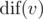
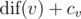
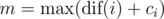
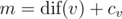
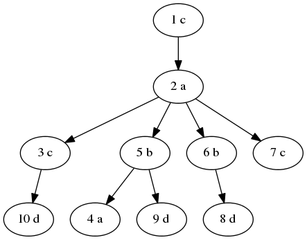
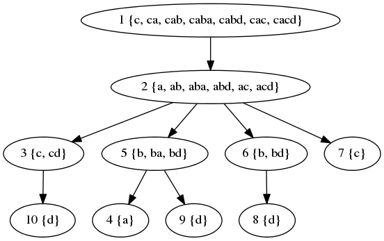
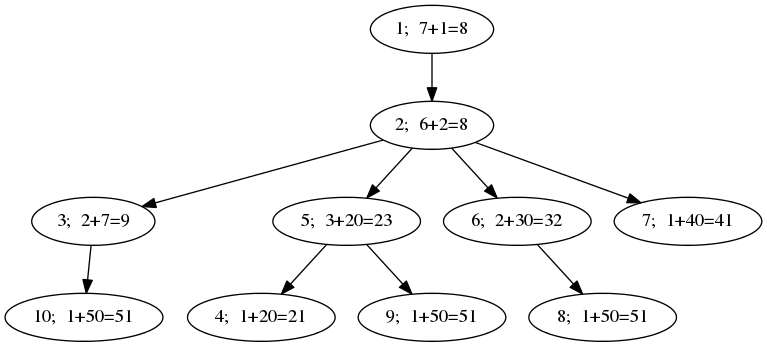
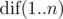
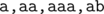
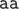

# D. Acyclic Organic Compounds

**time limit per test:** 3 seconds

**memory limit per test:** 512 megabytes

**input:** standard input

**output:** standard output

You are given a tree *T* with *n* vertices (numbered 1 through *n*) and a letter in each vertex. The tree is rooted at vertex 1.

Let's look at the subtree *T*~*v*~ of some vertex *v*. It is possible to read a string along each simple path starting at *v* and ending at some vertex in *T*~*v*~ (possibly *v* itself). Let's denote the number of distinct strings which can be read this way as



.

Also, there's a number *c*~*v*~ assigned to each vertex *v*. We are interested in vertices with the maximum value of



.

You should compute two statistics: the maximum value of


 and the number of vertices *v* with the maximum


.

#### Input

The first line of the input contains one integer *n* (1 ≤ *n* ≤ 300 000) — the number of vertices of the tree.

The second line contains *n* space-separated integers *c*~*i*~ (0 ≤ *c*~*i*~ ≤ 10^9^).

The third line contains a string *s* consisting of *n* lowercase English letters — the *i*-th character of this string is the letter in vertex *i*.

The following *n* - 1 lines describe the tree *T*. Each of them contains two space-separated integers *u* and *v* (1 ≤ *u*, *v* ≤ *n*) indicating an edge between vertices *u* and *v*.

It's guaranteed that the input will describe a tree.

#### Output

Print two lines.

On the first line, print



 over all 1 ≤ *i* ≤ *n*.

On the second line, print the number of vertices *v* for which



.

#### Examples

#### Input
```
10
1 2 7 20 20 30 40 50 50 50
cacabbcddd
1 2
6 8
7 2
6 2
5 4
5 9
3 10
2 5
2 3
```

#### Output
```
51
3
```

#### Input
```
6
0 2 4 1 1 1
raaaba
1 2
2 3
2 4
2 5
3 6
```

#### Output
```
6
2
```

#### Note

In the first sample, the tree looks like this:





The sets of strings that can be read from individual vertices are:





Finally, the values of


 are:





In the second sample, the values of



 are (5, 4, 2, 1, 1, 1). The distinct strings read in *T*~2~ are



; note that



 can be read down to vertices 3 or 4.
