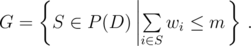
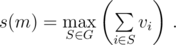
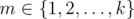
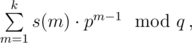
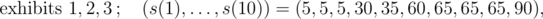
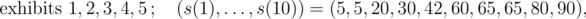
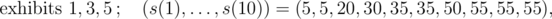
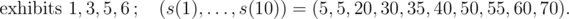

# E. A Museum Robbery

**time limit per test:** 2 seconds

**memory limit per test:** 256 megabytes

**input:** standard input

**output:** standard output

There's a famous museum in the city where Kleofáš lives. In the museum, *n* exhibits (numbered 1 through *n*) had been displayed for a long time; the *i*-th of those exhibits has value *v*~*i*~ and mass *w*~*i*~.

Then, the museum was bought by a large financial group and started to vary the exhibits. At about the same time, Kleofáš... gained interest in the museum, so to say.

You should process *q* events of three types:

- type 1 — the museum displays an exhibit with value *v* and mass *w*; the exhibit displayed in the *i*-th event of this type is numbered *n* + *i* (see sample explanation for more details)
- type 2 — the museum removes the exhibit with number *x* and stores it safely in its vault
- type 3 — Kleofáš visits the museum and wonders (for no important reason at all, of course): if there was a robbery and exhibits with total mass at most *m* were stolen, what would their maximum possible total value be?

For each event of type 3, let *s*(*m*) be the maximum possible total value of stolen exhibits with total mass  ≤ *m*.

Formally, let *D* be the set of numbers of all exhibits that are currently displayed (so initially *D* = {1, ..., n}). Let *P*(*D*) be the set of all subsets of *D* and let



Then, *s*(*m*) is defined as



Compute *s*(*m*) for each



. Note that the output follows a special format.

#### Input

The first line of the input contains two space-separated integers *n* and *k* (1 ≤ *n* ≤ 5000, 1 ≤ *k* ≤ 1000) — the initial number of exhibits in the museum and the maximum interesting mass of stolen exhibits.

Then, *n* lines follow. The *i*-th of them contains two space-separated positive integers *v*~*i*~ and *w*~*i*~ (1 ≤ *v*~*i*~ ≤ 1 000 000, 1 ≤ *w*~*i*~ ≤ 1000) — the value and mass of the *i*-th exhibit.

The next line contains a single integer *q* (1 ≤ *q* ≤ 30 000) — the number of events.

Each of the next *q* lines contains the description of one event in the following format:

- 1 *v* *w* — an event of type 1, a new exhibit with value *v* and mass *w* has been added (1 ≤ *v* ≤ 1 000 000, 1 ≤ *w* ≤ 1000)
- 2 *x* — an event of type 2, the exhibit with number *x* has been removed; it's guaranteed that the removed exhibit had been displayed at that time
- 3 — an event of type 3, Kleofáš visits the museum and asks his question

There will be at most 10 000 events of type 1 and at least one event of type 3.

#### Output

As the number of values *s*(*m*) can get large, output the answers to events of type 3 in a special format.

For each event of type 3, consider the values *s*(*m*) computed for the question that Kleofáš asked in this event; print one line containing a single number



where *p* = 10^7^ + 19 and *q* = 10^9^ + 7.

Print the answers to events of type 3 in the order in which they appear in the input.

#### Examples

#### Input
```
3 10
30 4
60 6
5 1
9
3
1 42 5
1 20 3
3
2 2
2 4
3
1 40 6
3
```

#### Output
```
556674384
168191145
947033915
181541912
```

#### Input
```
3 1000
100 42
100 47
400 15
4
2 2
2 1
2 3
3
```

#### Output
```
0
```

#### Note

In the first sample, the numbers of displayed exhibits and values *s*(1), ..., *s*(10) for individual events of type 3 are, in order:












The values of individual exhibits are *v*~1~ = 30, *v*~2~ = 60, *v*~3~ = 5, *v*~4~ = 42, *v*~5~ = 20, *v*~6~ = 40 and their masses are *w*~1~ = 4, *w*~2~ = 6, *w*~3~ = 1, *w*~4~ = 5, *w*~5~ = 3, *w*~6~ = 6.

In the second sample, the only question is asked after removing all exhibits, so *s*(*m*) = 0 for any *m*.
