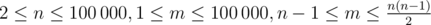

# B. Lazy Student

**time limit per test:** 2 seconds

**memory limit per test:** 256 megabytes

**input:** standard input

**output:** standard output

Student Vladislav came to his programming exam completely unprepared as usual. He got a question about some strange algorithm on a graph — something that will definitely never be useful in real life. He asked a girl sitting next to him to lend him some cheat papers for this questions and found there the following definition:

The minimum spanning tree *T* of graph *G* is such a tree that it contains all the vertices of the original graph *G*, and the sum of the weights of its edges is the minimum possible among all such trees.

Vladislav drew a graph with *n* vertices and *m* edges containing no loops and multiple edges. He found one of its minimum spanning trees and then wrote for each edge its weight and whether it is included in the found tree or not. Unfortunately, the piece of paper where the graph was painted is gone and the teacher is getting very angry and demands to see the original graph. Help Vladislav come up with a graph so that the information about the minimum spanning tree remains correct.

#### Input

The first line of the input contains two integers *n* and *m* (



) — the number of vertices and the number of edges in the graph.

Each of the next *m* lines describes an edge of the graph and consists of two integers *a*~*j*~ and *b*~*j*~ (1 ≤ *a*~*j*~ ≤ 10^9^, *b*~*j*~ = {0, 1}). The first of these numbers is the weight of the edge and the second number is equal to 1 if this edge was included in the minimum spanning tree found by Vladislav, or 0 if it was not.

It is guaranteed that exactly *n* - 1 number {*b*~*j*~} are equal to one and exactly *m* - *n* + 1 of them are equal to zero.

#### Output

If Vladislav has made a mistake and such graph doesn't exist, print  - 1.

Otherwise print *m* lines. On the *j*-th line print a pair of vertices (*u*~*j*~, *v*~*j*~) (1 ≤ *u*~*j*~, *v*~*j*~ ≤ *n*, *u*~*j*~ ≠ *v*~*j*~), that should be connected by the *j*-th edge. The edges are numbered in the same order as in the input. The graph, determined by these edges, must be connected, contain no loops or multiple edges and its edges with *b*~*j*~ = 1 must define the minimum spanning tree. In case there are multiple possible solutions, print any of them.

#### Examples

#### Input
```
4 5
2 1
3 1
4 0
1 1
5 0
```

#### Output
```
2 4
1 4
3 4
3 1
3 2
```

#### Input
```
3 3
1 0
2 1
3 1
```

#### Output
```
-1
```
