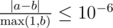

# C. Freelancer's Dreams

**time limit per test:** 2 seconds

**memory limit per test:** 256 megabytes

**input:** standard input

**output:** standard output

Mikhail the Freelancer dreams of two things: to become a cool programmer and to buy a flat in Moscow. To become a cool programmer, he needs at least *p* experience points, and a desired flat in Moscow costs *q* dollars. Mikhail is determined to follow his dreams and registered at a freelance site.

He has suggestions to work on *n* distinct projects. Mikhail has already evaluated that the participation in the *i*-th project will increase his experience by *a*~*i*~ per day and bring *b*~*i*~ dollars per day. As freelance work implies flexible working hours, Mikhail is free to stop working on one project at any time and start working on another project. Doing so, he receives the respective share of experience and money. Mikhail is only trying to become a cool programmer, so he is able to work only on one project at any moment of time.

Find the real value, equal to the minimum number of days Mikhail needs to make his dream come true.

For example, suppose Mikhail is suggested to work on three projects and *a*~1~ = 6, *b*~1~ = 2, *a*~2~ = 1, *b*~2~ = 3, *a*~3~ = 2, *b*~3~ = 6. Also, *p* = 20 and *q* = 20. In order to achieve his aims Mikhail has to work for 2.5 days on both first and third projects. Indeed, *a*~1~·2.5 + *a*~2~·0 + *a*~3~·2.5 = 6·2.5 + 1·0 + 2·2.5 = 20 and *b*~1~·2.5 + *b*~2~·0 + *b*~3~·2.5 = 2·2.5 + 3·0 + 6·2.5 = 20.

#### Input

The first line of the input contains three integers *n*, *p* and *q* (1 ≤ *n* ≤ 100 000, 1 ≤ *p*, *q* ≤ 1 000 000) — the number of projects and the required number of experience and money.

Each of the next *n* lines contains two integers *a*~*i*~ and *b*~*i*~ (1 ≤ *a*~*i*~, *b*~*i*~ ≤ 1 000 000) — the daily increase in experience and daily income for working on the *i*-th project.

#### Output

Print a real value — the minimum number of days Mikhail needs to get the required amount of experience and money. Your answer will be considered correct if its absolute or relative error does not exceed 10^ - 6^.

Namely: let's assume that your answer is *a*, and the answer of the jury is *b*. The checker program will consider your answer correct, if



.

#### Examples

#### Input
```
3 20 20
6 2
1 3
2 6
```

#### Output
```
5.000000000000000
```

#### Input
```
4 1 1
2 3
3 2
2 3
3 2
```

#### Output
```
0.400000000000000
```

#### Note

First sample corresponds to the example in the problem statement.
