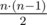
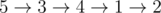
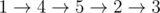

# D. Hamiltonian Spanning Tree

**time limit per test:** 2 seconds

**memory limit per test:** 256 megabytes

**input:** standard input

**output:** standard output

A group of *n* cities is connected by a network of roads. There is an undirected road between every pair of cities, so there are



 roads in total. It takes exactly *y* seconds to traverse any single road.

A spanning tree is a set of roads containing exactly *n* - 1 roads such that it's possible to travel between any two cities using only these roads.

Some spanning tree of the initial network was chosen. For every road in this tree the time one needs to traverse this road was changed from *y* to *x* seconds. Note that it's not guaranteed that *x* is smaller than *y*.

You would like to travel through all the cities using the shortest path possible. Given *n*, *x*, *y* and a description of the spanning tree that was chosen, find the cost of the shortest path that starts in any city, ends in any city and visits all cities exactly once.

#### Input

The first line of the input contains three integers *n*, *x* and *y* (2 ≤ *n* ≤ 200 000, 1 ≤ *x*, *y* ≤ 10^9^).

Each of the next *n* - 1 lines contains a description of a road in the spanning tree. The *i*-th of these lines contains two integers *u*~*i*~ and *v*~*i*~ (1 ≤ *u*~*i*~, *v*~*i*~ ≤ *n*) — indices of the cities connected by the *i*-th road. It is guaranteed that these roads form a spanning tree.

#### Output

Print a single integer — the minimum number of seconds one needs to spend in order to visit all the cities exactly once.

#### Examples

#### Input
```
5 2 3
1 2
1 3
3 4
5 3
```

#### Output
```
9
```

#### Input
```
5 3 2
1 2
1 3
3 4
5 3
```

#### Output
```
8
```

#### Note

In the first sample, roads of the spanning tree have cost 2, while other roads have cost 3. One example of an optimal path is



.

In the second sample, we have the same spanning tree, but roads in the spanning tree cost 3, while other roads cost 2. One example of an optimal path is



.
