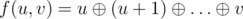

# F. Xors on Segments

**time limit per test:** 10 seconds

**memory limit per test:** 512 megabytes

**input:** standard input

**output:** standard output

You are given an array with *n* integers *a*~*i*~ and *m* queries. Each query is described by two integers (*l*~*j*~, *r*~*j*~).

Let's define the function



. The function is defined for only *u* ≤ *v*.

For each query print the maximal value of the function *f*(*a*~*x*~, *a*~*y*~) over all *l*~*j*~ ≤ *x*, *y* ≤ *r*~*j*~,  *a*~*x*~ ≤ *a*~*y*~.

#### Input

The first line contains two integers *n*, *m* (1 ≤ *n* ≤ 5·10^4^,  1 ≤ *m* ≤ 5·10^3^) — the size of the array and the number of the queries.

The second line contains *n* integers *a*~*i*~ (1 ≤ *a*~*i*~ ≤ 10^6^) — the elements of the array *a*.

Each of the next *m* lines contains two integers *l*~*j*~, *r*~*j*~ (1 ≤ *l*~*j*~ ≤ *r*~*j*~ ≤ *n*) – the parameters of the *j*-th query.

#### Output

For each query print the value *a*~*j*~ on a separate line — the maximal value of the function *f*(*a*~*x*~, *a*~*y*~) over all *l*~*j*~ ≤ *x*, *y* ≤ *r*~*j*~,  *a*~*x*~ ≤ *a*~*y*~.

#### Examples

#### Input
```
6 3
1 2 3 4 5 6
1 6
2 5
3 4
```

#### Output
```
7
7
7
```

#### Input
```
1 1
1
1 1
```

#### Output
```
1
```

#### Input
```
6 20
10 21312 2314 214 1 322
1 1
1 2
1 3
1 4
1 5
1 6
2 2
2 3
2 4
2 5
2 6
3 4
3 5
3 6
4 4
4 5
4 6
5 5
5 6
6 6
```

#### Output
```
10
21313
21313
21313
21313
21313
21312
21313
21313
21313
21313
2314
2315
2315
214
215
323
1
323
322
```
