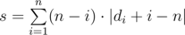

# D. Optimal Number Permutation

**time limit per test:** 1 second

**memory limit per test:** 256 megabytes

**input:** standard input

**output:** standard output

You have array *a* that contains all integers from 1 to *n* twice. You can arbitrary permute any numbers in *a*.

Let number *i* be in positions *x*~*i*~, *y*~*i*~ (*x*~*i*~ < *y*~*i*~) in the permuted array *a*. Let's define the value *d*~*i*~ = *y*~*i*~ - *x*~*i*~ — the distance between the positions of the number *i*. Permute the numbers in array *a* to minimize the value of the sum



.

#### Input

The only line contains integer *n* (1 ≤ *n* ≤ 5·10^5^).

#### Output

Print 2*n* integers — the permuted array *a* that minimizes the value of the sum *s*.

#### Examples

#### Input
```
2
```

#### Output
```
1 1 2 2
```

#### Input
```
1
```

#### Output
```
1 1
```
