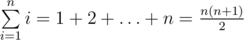
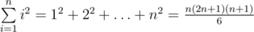
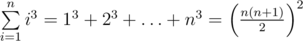
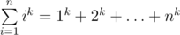

# F. The Sum of the k-th Powers

**time limit per test:** 2 seconds

**memory limit per test:** 256 megabytes

**input:** standard input

**output:** standard output

There are well-known formulas:



,



,



. Also mathematicians found similar formulas for higher degrees.

Find the value of the sum



 modulo 10^9^ + 7 (so you should find the remainder after dividing the answer by the value 10^9^ + 7).

#### Input

The only line contains two integers *n*, *k* (1 ≤ *n* ≤ 10^9^, 0 ≤ *k* ≤ 10^6^).

#### Output

Print the only integer *a* — the remainder after dividing the value of the sum by the value 10^9^ + 7.

#### Examples

#### Input
```
4 1
```

#### Output
```
10
```

#### Input
```
4 2
```

#### Output
```
30
```

#### Input
```
4 3
```

#### Output
```
100
```

#### Input
```
4 0
```

#### Output
```
4
```
