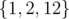
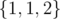

# E. Simple Skewness

**time limit per test:** 3 seconds

**memory limit per test:** 256 megabytes

**input:** standard input

**output:** standard output

Define the simple skewness of a collection of numbers to be the collection's mean minus its median. You are given a list of *n* (not necessarily distinct) integers. Find the non-empty subset (with repetition) with the maximum simple skewness.

The mean of a collection is the average of its elements. The median of a collection is its middle element when all of its elements are sorted, or the average of its two middle elements if it has even size.

#### Input

The first line of the input contains a single integer *n* (1 ≤ *n* ≤ 200 000) — the number of elements in the list.

The second line contains *n* integers *x*~*i*~ (0 ≤ *x*~*i*~ ≤ 1 000 000) — the *i*th element of the list.

#### Output

In the first line, print a single integer *k* — the size of the subset.

In the second line, print *k* integers — the elements of the subset in any order.

If there are multiple optimal subsets, print any.

#### Examples

#### Input
```
4
1 2 3 12
```

#### Output
```
3
1 2 12 
```

#### Input
```
4
1 1 2 2
```

#### Output
```
3
1 1 2 
```

#### Input
```
2
1 2
```

#### Output
```
2
1 2
```

#### Note

In the first case, the optimal subset is



, which has mean 5, median 2, and simple skewness of 5 - 2 = 3.

In the second case, the optimal subset is



. Note that repetition is allowed.

In the last case, any subset has the same median and mean, so all have simple skewness of 0.
