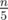

# F. Bear and Fair Set

**time limit per test:** 2 seconds

**memory limit per test:** 256 megabytes

**input:** standard input

**output:** standard output

Limak is a grizzly bear. He is big and dreadful. You were chilling in the forest when you suddenly met him. It's very unfortunate for you. He will eat all your cookies unless you can demonstrate your mathematical skills. To test you, Limak is going to give you a puzzle to solve.

It's a well-known fact that Limak, as every bear, owns a set of numbers. You know some information about the set:

- The elements of the set are distinct positive integers.
- The number of elements in the set is *n*. The number *n* is divisible by 5.
- All elements are between 1 and *b*, inclusive: bears don't know numbers greater than *b*.
- For each *r* in {0, 1, 2, 3, 4}, the set contains exactly


 elements that give remainder *r* when divided by 5. (That is, there are


 elements divisible by 5,


 elements of the form 5*k* + 1,



 elements of the form 5*k* + 2, and so on.)

Limak smiles mysteriously and gives you *q* hints about his set. The *i*-th hint is the following sentence: "If you only look at elements that are between 1 and *upTo*~*i*~, inclusive, you will find exactly *quantity*~*i*~ such elements in my set."

In a moment Limak will tell you the actual puzzle, but something doesn't seem right... That smile was very strange. You start to think about a possible reason. Maybe Limak cheated you? Or is he a fair grizzly bear?

Given *n*, *b*, *q* and hints, check whether Limak can be fair, i.e. there exists at least one set satisfying the given conditions. If it's possible then print ''fair". Otherwise, print ''unfair".

#### Input

The first line contains three integers *n*, *b* and *q* (5 ≤ *n* ≤ *b* ≤ 10^4^, 1 ≤ *q* ≤ 10^4^, *n* divisible by 5) — the size of the set, the upper limit for numbers in the set and the number of hints.

The next *q* lines describe the hints. The *i*-th of them contains two integers *upTo*~*i*~ and *quantity*~*i*~ (1 ≤ *upTo*~*i*~ ≤ *b*, 0 ≤ *quantity*~*i*~ ≤ *n*).

#### Output

Print ''fair" if there exists at least one set that has all the required properties and matches all the given hints. Otherwise, print ''unfair".

#### Examples

#### Input
```
10 20 1
10 10
```

#### Output
```
fair
```

#### Input
```
10 20 3
15 10
5 0
10 5
```

#### Output
```
fair
```

#### Input
```
10 20 2
15 3
20 10
```

#### Output
```
unfair
```

#### Note

In the first example there is only one set satisfying all conditions: {1, 2, 3, 4, 5, 6, 7, 8, 9, 10}.

In the second example also there is only one set satisfying all conditions: {6, 7, 8, 9, 10, 11, 12, 13, 14, 15}.

Easy to see that there is no set satisfying all conditions from the third example. So Limak lied to you :-(
