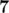
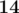
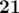
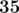

# D. Fibonacci-ish

**time limit per test:** 3 seconds

**memory limit per test:** 512 megabytes

**input:** standard input

**output:** standard output

Yash has recently learnt about the Fibonacci sequence and is very excited about it. He calls a sequence Fibonacci-ish if

- the sequence consists of at least two elements
- *f*~0~ and *f*~1~ are arbitrary
- *f*~*n* + 2~ = *f*~*n* + 1~ + *f*~*n*~ for all *n* ≥ 0.

You are given some sequence of integers *a*~1~, *a*~2~, ..., *a*~*n*~. Your task is rearrange elements of this sequence in such a way that its longest possible prefix is Fibonacci-ish sequence.

#### Input

The first line of the input contains a single integer *n* (2 ≤ *n* ≤ 1000) — the length of the sequence *a*~*i*~.

The second line contains *n* integers *a*~1~, *a*~2~, ..., *a*~*n*~ (|*a*~*i*~| ≤ 10^9^).

#### Output

Print the length of the longest possible Fibonacci-ish prefix of the given sequence after rearrangement.

#### Examples

#### Input
```
3
1 2 -1
```

#### Output
```
3
```

#### Input
```
5
28 35 7 14 21
```

#### Output
```
4
```

#### Note

In the first sample, if we rearrange elements of the sequence as  - 1, 2, 1, the whole sequence *a*~*i*~ would be Fibonacci-ish.

In the second sample, the optimal way to rearrange elements is



,



,



,



, 28.
