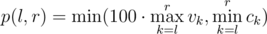

# E. Startup Funding

**time limit per test:** 3 seconds

**memory limit per test:** 256 megabytes

**input:** standard input

**output:** standard output

An e-commerce startup pitches to the investors to get funding. They have been functional for *n* weeks now and also have a website!

For each week they know the number of unique visitors during this week *v*~*i*~ and the revenue *c*~*i*~. To evaluate the potential of the startup at some range of weeks from *l* to *r* inclusive investors use the minimum among the maximum number of visitors multiplied by 100 and the minimum revenue during this period, that is:



The truth is that investors have no idea how to efficiently evaluate the startup, so they are going to pick some *k* random distinct weeks *l*~*i*~ and give them to managers of the startup. For each *l*~*i*~ they should pick some *r*~*i*~ ≥ *l*~*i*~ and report maximum number of visitors and minimum revenue during this period.

Then, investors will calculate the potential of the startup for each of these ranges and take minimum value of *p*(*l*~*i*~, *r*~*i*~) as the total evaluation grade of the startup. Assuming that managers of the startup always report the optimal values of *r*~*i*~ for some particular *l*~*i*~, i.e., the value such that the resulting grade of the startup is maximized, what is the expected resulting grade of the startup?

#### Input

The first line of the input contains two integers *n* and *k* (1 ≤ *k* ≤ *n* ≤ 1 000 000).

The second line contains *n* integers *v*~*i*~ (1 ≤ *v*~*i*~ ≤ 10^7^) — the number of unique visitors during each week.

The third line contains *n* integers *c*~*i*~ (1 ≤ *c*~*i*~ ≤ 10^7^) —the revenue for each week.

#### Output

Print a single real value — the expected grade of the startup. Your answer will be considered correct if its absolute or relative error does not exceed 10^ - 6^.

Namely: let's assume that your answer is *a*, and the answer of the jury is *b*. The checker program will consider your answer correct, if


.

#### Examples

#### Input
```
3 2
3 2 1
300 200 300
```

#### Output
```
133.3333333
```

#### Note

Consider the first sample.

If the investors ask for *l*~*i*~ = 1 onwards, startup will choose *r*~*i*~ = 1, such that max number of visitors is 3 and minimum revenue is 300. Thus, potential in this case is *min*(3·100, 300) = 300.

If the investors ask for *l*~*i*~ = 2 onwards, startup will choose *r*~*i*~ = 3, such that max number of visitors is 2 and minimum revenue is 200. Thus, potential in this case is *min*(2·100, 200) = 200.

If the investors ask for *l*~*i*~ = 3 onwards, startup will choose *r*~*i*~ = 3, such that max number of visitors is 1 and minimum revenue is 300. Thus, potential in this case is *min*(1·100, 300) = 100.

We have to choose a set of size 2 equi-probably and take minimum of each. The possible sets here are : {200, 300},{100, 300},{100, 200}, effectively the set of possible values as perceived by investors equi-probably: {200, 100, 100}. Thus, the expected value is (100 + 200 + 100) / 3 = 133.(3).
