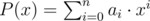

# C. Bear and Polynomials

**time limit per test:** 2 seconds

**memory limit per test:** 256 megabytes

**input:** standard input

**output:** standard output

Limak is a little polar bear. He doesn't have many toys and thus he often plays with polynomials.

He considers a polynomial valid if its degree is *n* and its coefficients are integers not exceeding *k* by the absolute value. More formally:

Let *a*~0~, *a*~1~, ..., *a*~*n*~ denote the coefficients, so


. Then, a polynomial *P*(*x*) is valid if all the following conditions are satisfied:

- *a*~*i*~ is integer for every *i*;
- |*a*~*i*~| ≤ *k* for every *i*;
- *a*~*n*~ ≠ 0.

Limak has recently got a valid polynomial *P* with coefficients *a*~0~, *a*~1~, *a*~2~, ..., *a*~*n*~. He noticed that *P*(2) ≠ 0 and he wants to change it. He is going to change one coefficient to get a valid polynomial *Q* of degree *n* that *Q*(2) = 0. Count the number of ways to do so. You should count two ways as a distinct if coefficients of target polynoms differ.

#### Input

The first line contains two integers *n* and *k* (1 ≤ *n* ≤ 200 000, 1 ≤ *k* ≤ 10^9^) — the degree of the polynomial and the limit for absolute values of coefficients.

The second line contains *n* + 1 integers *a*~0~, *a*~1~, ..., *a*~*n*~ (|*a*~*i*~| ≤ *k*, *a*~*n*~ ≠ 0) — describing a valid polynomial



. It's guaranteed that *P*(2) ≠ 0.

#### Output

Print the number of ways to change one coefficient to get a valid polynomial *Q* that *Q*(2) = 0.

#### Examples

#### Input
```
3 1000000000
10 -9 -3 5
```

#### Output
```
3
```

#### Input
```
3 12
10 -9 -3 5
```

#### Output
```
2
```

#### Input
```
2 20
14 -7 19
```

#### Output
```
0
```

#### Note

In the first sample, we are given a polynomial *P*(*x*) = 10 - 9*x* - 3*x*^2^ + 5*x*^3^.

Limak can change one coefficient in three ways:

- He can set *a*~0~ =  - 10. Then he would get *Q*(*x*) =  - 10 - 9*x* - 3*x*^2^ + 5*x*^3^ and indeed *Q*(2) =  - 10 - 18 - 12 + 40 = 0.
- Or he can set *a*~2~ =  - 8. Then *Q*(*x*) = 10 - 9*x* - 8*x*^2^ + 5*x*^3^ and indeed *Q*(2) = 10 - 18 - 32 + 40 = 0.
- Or he can set *a*~1~ =  - 19. Then *Q*(*x*) = 10 - 19*x* - 3*x*^2^ + 5*x*^3^ and indeed *Q*(2) = 10 - 38 - 12 + 40 = 0.

In the second sample, we are given the same polynomial. This time though, *k* is equal to 12 instead of 10^9^. Two first of ways listed above are still valid but in the third way we would get |*a*~1~| > *k* what is not allowed. Thus, the answer is 2 this time.
