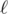
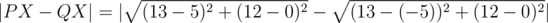
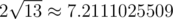

# G. Armistice Area Apportionment

**time limit per test:** 3 seconds

**memory limit per test:** 256 megabytes

**input:** standard input

**output:** standard output

After a drawn-out mooclear arms race, Farmer John and the Mischievous Mess Makers have finally agreed to establish peace. They plan to divide the territory of Bovinia with a line passing through at least two of the *n* outposts scattered throughout the land. These outposts, remnants of the conflict, are located at the points (*x*~1~, *y*~1~), (*x*~2~, *y*~2~), ..., (*x*~*n*~, *y*~*n*~).

In order to find the optimal dividing line, Farmer John and Elsie have plotted a map of Bovinia on the coordinate plane. Farmer John's farm and the Mischievous Mess Makers' base are located at the points *P* = (*a*, 0) and *Q* = ( - *a*, 0), respectively. Because they seek a lasting peace, Farmer John and Elsie would like to minimize the maximum difference between the distances from any point on the line to *P* and *Q*.

Formally, define the difference of a line


 relative to two points *P* and *Q* as the smallest real number *d* so that for all points *X* on line


, |*PX* - *QX*| ≤ *d*. (It is guaranteed that *d* exists and is unique.) They wish to find the line



 passing through two distinct outposts (*x*~*i*~, *y*~*i*~) and (*x*~*j*~, *y*~*j*~) such that the difference of


 relative to *P* and *Q* is minimized.

#### Input

The first line of the input contains two integers *n* and *a* (2 ≤ *n* ≤ 100 000, 1 ≤ *a* ≤ 10 000) — the number of outposts and the coordinates of the farm and the base, respectively.

The following *n* lines describe the locations of the outposts as pairs of integers (*x*~*i*~, *y*~*i*~) (|*x*~*i*~|, |*y*~*i*~| ≤ 10 000). These points are distinct from each other as well as from *P* and *Q*.

#### Output

Print a single real number—the difference of the optimal dividing line. Your answer will be considered correct if its absolute or relative error does not exceed 10^ - 6^.

Namely: let's assume that your answer is *a*, and the answer of the jury is *b*. The checker program will consider your answer correct, if


.

#### Examples

#### Input
```
2 5
1 0
2 1
```

#### Output
```
7.2111025509
```

#### Input
```
3 6
0 1
2 5
0 -3
```

#### Output
```
0.0000000000
```

#### Note

In the first sample case, the only possible line


 is *y* = *x* - 1. It can be shown that the point *X* which maximizes |*PX* - *QX*| is (13, 12), with



, which is



.

In the second sample case, if we pick the points (0, 1) and (0,  - 3), we get


 as *x* = 0. Because *PX* = *QX* on this line, the minimum possible difference is 0.
