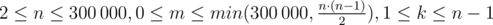

# E. Bear and Forgotten Tree 2

**time limit per test:** 2 seconds

**memory limit per test:** 256 megabytes

**input:** standard input

**output:** standard output

A tree is a connected undirected graph consisting of *n* vertices and *n*  -  1 edges. Vertices are numbered 1 through *n*.

Limak is a little polar bear. He once had a tree with *n* vertices but he lost it. He still remembers something about the lost tree though.

You are given *m* pairs of vertices (*a*~1~, *b*~1~), (*a*~2~, *b*~2~), ..., (*a*~*m*~, *b*~*m*~). Limak remembers that for each *i* there was no edge between *a*~*i*~ and *b*~*i*~. He also remembers that vertex 1 was incident to exactly *k* edges (its degree was equal to *k*).

Is it possible that Limak remembers everything correctly? Check whether there exists a tree satisfying the given conditions.

#### Input

The first line of the input contains three integers *n*, *m* and *k* (



) — the number of vertices in Limak's tree, the number of forbidden pairs of vertices, and the degree of vertex 1, respectively.

The *i*-th of next *m* lines contains two distinct integers *a*~*i*~ and *b*~*i*~ (1 ≤ *a*~*i*~, *b*~*i*~ ≤ *n*, *a*~*i*~ ≠ *b*~*i*~) — the *i*-th pair that is forbidden. It's guaranteed that each pair of vertices will appear at most once in the input.

#### Output

Print "possible" (without quotes) if there exists at least one tree satisfying the given conditions. Otherwise, print "impossible" (without quotes).

#### Examples

#### Input
```
5 4 2
1 2
2 3
4 2
4 1
```

#### Output
```
possible
```

#### Input
```
6 5 3
1 2
1 3
1 4
1 5
1 6
```

#### Output
```
impossible
```

#### Note

In the first sample, there are *n* = 5 vertices. The degree of vertex 1 should be *k* = 2. All conditions are satisfied for a tree with edges 1 - 5, 5 - 2, 1 - 3 and 3 - 4.

In the second sample, Limak remembers that none of the following edges existed: 1 - 2, 1 - 3, 1 - 4, 1 - 5 and 1 - 6. Hence, vertex 1 couldn't be connected to any other vertex and it implies that there is no suitable tree.
